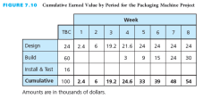
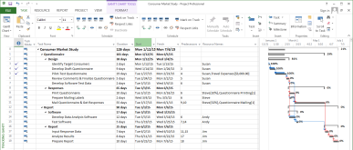

# Chapter 4 #

This chapter discusses the project scope document, quality, how to define what activities need to be done, who will be responsible for them, and in what sequence they will be performed. It describes techniques and tools used to plan the work items and activities that need to be performed in order to accomplish the project objective successfully. The project scope defines what work needs to be done and what deliverables need to be produced. Then, specific activities are defined and arranged in a sequence of dependent relationships to determine how the work will be performed.

Based upon this chapter, students will become familiar with

-   Clearly defining the project objective

-   Preparing a project scope document

-   Understanding the importance of planning for quality

-   Creating a work breakdown structure

-   Assigning responsibility for work items

-   Defining specific activities

-   Creating a network diagram

-   Utilizing a project management methodology called the systems development life cycle for information systems development projects

Learning Outcomes
=================

After studying this chapter, the learner should be able to:

-   Establish a clear project objective

-   Prepare a project scope document

-   Discuss the importance and elements of a project quality plan

-   Develop a work breakdown structure

-   Prepare a responsibility assignment matrix

-   Describe how to define specific activities

-   Create a network diagram

Project Management Knowledge Areas from PMBOK® Guide
====================================================

Concepts in this chapter support the following Project Management Knowledge Areas of

*A Guide to the Project Management Body of Knowledge (PMBOK*® *Guide*):

-   Project Integration Management

-   Project Scope Management

-   Project Quality Management

-   Project Time Management

Teaching Strategies
===================

1.  The two vignettes reinforce the need to plan the project before starting to help save money, time, rework, and wasted effort. Have students work in groups and review one of the quotes from the vignettes then suggest how planning saved the project from being failures.

2.  Sometimes planning seems to be a waste of time for a short project. Tell students a story of a failed project. Have students identify how having a clear project objective, a project scope document, a project plan, a work breakdown structure, a responsibility assignment matrix, and a network diagram could have changed the outcome

3.  Have students create a work breakdown structure and network diagram for a project they will have to complete during the class semester. Have the students explain the relationship between tasks that must be completed sequentially and those that can be completed at the same time.

4.  The network diagram for the consumer market study is included in the chapter materials. Have the students compare the textbook diagram with the one created in Microsoft Project and report on the similarities and the differences.

Lecture Notes
=============

1. Real-World Project Management Examples
-----------------------------------------

### Vignette A: Project Runaway

David English is given the green light for a project and creates a project team with experts in charge of the aspects that are within their expertise rather than the project manager. The planning is set to be scheduled to allow a legitimate cushion in the timeline for the borrowed resources for the project.

-   A project was needed to help the $150 million company with 750 employees in 45 cities in Canada and the United States to integrate finance, customer relationship, and human resource management systems.

-   The CFO assembled the right members to create a cross-functional team.

    -   The team members had the expertise he lacked.

    -   Subject-matter experts were assigned oversight on the portions of the project of their expertise.

    -   The CFO provided overall project management of the team.

    -   Team members were assigned to his project for only a portion of their workweek.

-   A common impedance of project progress is the distraction of tasks required by the team member’s regular workweek.

    -   Understood the significant communication necessary and the concern for the team members’ time

    -   Activity sequence and assigning responsibility were forefront in English’s plan.

    -   Kept the team motivated

        A good definition of the project scope with stated quality plans helps to secure a green light for the project from management. Careful selection of the project team, assigned responsibility, and an appropriate activity sequence will help to avoid a project runaway.

### Vignette B: Building Abroad

Ertis describes what a project manager should consider if planning a construction project abroad.

-   Projects are guided by unique circumstances, especially if they are in foreign countries.

-   “One thing that is constant, however, is relationship is king. You have to be comfortable with your local representative. You can’t be cavalier about contracts. If you think they carry the same weight as they do in the U.S., you’re wrong.”

-   Ertis advises other project managers about the critical steps and considerations when planning a construction project outside the United States.

    -   The project scope is the critical first step.

    -   The subsequent critical steps are dependent upon the project scope and dictate the project planning.

-   Protocols for following government regulations define quality requirements to ensure the proper infrastructure.

    -   Requirements such immigration implications, regulations, submission processes, and substitutions all impact project quality.

    -   Ertis cautions project managers to develop procedures to have an in-country advocate inspect materials and processes to ensure each is adequate and correct for the project requirements

    -   Assignment of responsibility to an in-country partner is a means of improving the likelihood of meeting deadlines and having a successful project outcome.

2. Establish Project Objective
------------------------------

-   The planning process is based on the project objective, which establishes what is to be accomplished.

    -   Often the project objective is stated in the project charter or request for proposal.

    -   The objective is the tangible end product that the project team or contractor must produce and deliver in order for the sponsor or customer to achieve the expected benefits from implementing the project.

-   The project objective should include the following elements:

    -   Expected benefits that will result from implementation of the project and define success

    -   Primary project end product or deliverable

    -   Date by which the project is required to be completed

    -   Budget within which the project must be completed

-   There can be situations where the project objective needs to be modified as the project proceeds because of extenuating circumstances or new information. The project manager and the customer must agree on all changes to the project objective. Any such changes might affect the remaining work scope, deliverables, completion date, and final cost.

3. Define Project Scope
-----------------------

-   The project scope defines what needs to be done.

-   A project scope document includes many of the items contained in the project charter, RFP, or contractor’s proposal, but in much greater detail. The document is valuable for establishing a common understanding among project stakeholders regarding the scope of the project.

-   The project scope document usually contains the following sections:

    -   Customer requirements define the functional, operational, and performance specifications or capabilities that must be met for the project’s end product and other project deliverables. They should also include or reference applicable technical specifications, standards, and codes that must be used and met regarding quality and performance of the project work and deliverables.

    -   Statement of Work (SOW) defines the major tasks that will need to be performed to accomplish the work and produce all the project deliverables.

    -   Deliverables are the products or outputs that the project team or contractor will produce and provide to the customer during and at the completion of the performance of the project.

    -   Acceptance criteria for all project deliverables must be described in greater detail than what is stated in the project charter or request for proposal

    -   Work Breakdown Structure (WBS) is a hierarchical decomposition of the project work scope into work packages that produce the project deliverables.

-   The agreed-upon project scope document establishes the baseline for any changes that may be made to the scope during the performance of the project.

-   A change control system needs to be established to define how changes will be documented, approved, and communicated. The project team or contractor must avoid scope creep, which is informally making changes to the project scope without appropriate approval.

4. Plan for Quality
-------------------

-   It is important to plan for quality in performing the project to ensure that the work is done according to specifications and applicable standards and that deliverables meet acceptance criteria.

-   Planning for quality is a necessary, yet often forgotten or dismissed, function on a project. It is essential to have a plan for ensuring the quality of project deliverables and results, rather than waiting until the end of the project to check that sponsor/customer requirements and expectations have been met.

-   A project quality plan includes or references the specifications, industry or government standards (for design, testing, safety, construction, etc.), and codes that must be used and met during the performance of the project work.

-   To help ensure quality, the project quality plan should contain written procedures for using various quality tools and techniques.

-   The key to quality control is to monitor the quality of the work early and regularly throughout the performance of the project, compare results with quality standards, and make any necessary corrective actions immediately, rather than waiting until all the work is complete before checking or inspecting for quality.

-   The focus must be on doing it right the first time by doing the work in accordance with quality standards, and therefore preventing quality problems, rather than relying on after-the-fact inspections or testing and then having to do additional work to correct quality problems.

-   People who think they do not have enough time to do the work right the first time must then take the time later to redo it correctly—haste makes waste!

5. Create Work Breakdown Structure
----------------------------------

-   Once the project scope document has been prepared and agreed on, the next step in the planning phase is to create a detailed work breakdown structure (WBS), which is a deliverable-oriented hierarchical decomposition of the project work scope into work packages that produce the project deliverables.

-   Creating a WBS is a structured approach for organizing all the project work and deliverables into logical groupings and subdividing them into more manageable components to help ensure that all the work and deliverables to complete the project are identified and included in the baseline project plan.

-   The work breakdown structure subdivides the project into smaller pieces called work items.

-   The WBS should be decomposed to a level that identifies individual work packages for each specific deliverable listed in the project scope document.

    -   The level at which a specific deliverable is produced as the output or end product of the work associated with a work package.

    -   The level at which there is a high degree of confidence that all the activities that need to be performed to produce the deliverable can be defined, the types and quantities of resources can be determined, and the associated activity durations and costs can be reasonably estimated.

    -   The level at which a single organization (marketing communications, materials engineering, human resources, a subcontractor, etc.) or individual can be assigned responsibility and accountability for accomplishing the work package.

    -   The level at which the project manager wants to monitor and control the budget, and can collect data on actual costs and the value of the work completed during the performance of the project.

-   The WBS can be created using a graphic chart format or as an indentured list.

Figure 4.1 depicts the work breakdown structure in a graphic chart format for a community festival project. Not all the branches in a WBS have to be broken down to the same level.

Figure 4.2 depicts the WBS for the consumer market study project example. This project is the example used in the Microsoft Project appendices. Have students examine the relationship between Figure 4.2 and the entries into the Microsoft Project task list.

Figure 4.3 depicts an indentured list for the work breakdown structure. For each of the work packages, the deliverable is listed. This format is helpful for large projects in which a diagram would be too large and unwieldy.

6. Assign Responsibility
------------------------

-   A responsibility assignment matrix (RAM) defines who will be responsible for the work. It is a tool to designate the individuals responsible for accomplishing the work items in the work breakdown structure. Figure 4.4 depicts the RAM for the WBS in Figure 4.1, community festival project.

    -   The responsibility assignment matrix may use a P to designate primary responsibility and an S to indicate support responsibility for a specific work item.

    -   The RAM shows all the individuals associated with each work item in the work breakdown structure, as well as all the work items associated with each individual.

-   Only one individual should be designated as the lead, or primary, person responsible for each work item.

7. Define Activities
--------------------

-   Using the work breakdown structure, the individual or team responsible for each work package must next define all the specific activities that need to be performed to produce the end item or deliverable for the work package.

-   When all the specific activities have been defined for all of the work packages, they should be consolidated into a comprehensive activity list.

-   Figure 4.5, the work breakdown structure for a consumer market study project, depicts the specific activities that need to be performed for each work package. Have the students compare this list to the entries for the tasks in the Microsoft Project appendix.

8. Sequence Activities
----------------------

A network diagram defines the sequence of how the activities will get done. It is a tool for arranging the specific activities in the appropriate sequence and defining their dependent relationships.

-   The three most common techniques of network diagramming are program evaluation and review technique (PERT), the critical path method (CPM), and the precedence diagramming method (PDM).

-   In the past, there were distinguishable methodological differences between PERT and CPM. Today, however, when most people refer to a CPM diagram or PERT chart, they mean a generic network diagram.

### A. Network Principles

-   Each activity is represented by a box in the network diagram, and the description of the activity is written within the box, as shown in this figure.

-   Activities consume time, and their description usually starts with a verb.

-   Activities have a dependent relationship—that is, they are linked in a logical sequence to show which activities must be finished before others can start.

    -   Certain activities have to be done in serial sequence.

    -   Some activities can be done concurrently.

### i. Loops

-   An illogical relationship among activities is known as a loop. In preparing a network diagram, drawing activities in a loop is not acceptable because it portrays a path of activities that perpetually repeats itself.

### ii. Laddering

-   Some projects have a set of activities that are repeated several times.

-   Figure 4.6 indicates that all the activities must be done in serial sequence, which means that at any one time only one person is working while two other people are waiting.

-   Figure 4.7 indicates that all three rooms can be done concurrently, which is not possible because only one expert is available for each type of activity.

-   Figure 4.8 shows a technique known as laddering.

-   This approach will allow the project to be completed in the shortest possible time while making the best use of available resources (the experts).

### B. Create Network Diagram

-   A network diagram is a drawing of the activities for a project, showing them as boxes in their logical sequence and connected by arrows to indicate the required dependent relationships, as the project should be performed from start to completion.

-   Three questions need to be asked for each activity, and the network diagram is based upon the answers:

    -   Which activities must be finished immediately before this activity can be started?

    -   Which activities can be done concurrently with this activity?

    -   Which activities cannot be started until immediately after this activity has been finished?

-   Guidelines for the level of detail in the network diagram are:

    -   Based on the work breakdown structure for a project, specific activities should be defined for each work package.

    -   It may be preferable to draw a summary-level network first, showing a small number of higher-level activities, and then expand it to a more detailed network.

    -   The level of detail may be determined by certain obvious interface or transfer points: where there is a change in responsibility or a tangible output results from an activity.

    -   Activities should not be longer in estimated duration than the time intervals at which actual project progress will be reviewed and compared to planned progress.

-   It is not unusual to progressively elaborate the network diagram as the project progresses and more information is known or becomes clear.

-   Subnetworks can represent similar projects for different customers, and certain portions of projects can include the same types of activities in the same sequence and dependent relationships.

-   Figure 4.9 shows a complete network diagram for the consumer market study project, including the person responsible for each activity.

-   Figure 4.13 shows a network diagram for the web-based reporting system project.

9. Planning for Information Systems Development
-----------------------------------------------

This example continues through Chapters 4 to 8 and highlights the concepts for each. The Microsoft Project file for the example will be available with the instructor materials.

-   An information system (IS) is a computer-based system that accepts data as input, processes the data, and produces useful information for users.

-   Information systems include computerized order entry systems, e-commerce systems, automatic teller machines, and billing, payroll, and inventory systems.

-   The development of an IS is a challenging process that requires extensive planning and control to ensure that the system meets user requirements and is finished on time and within budget.

-   A project management planning tool, or methodology, called the systems development life cycle (SDLC) is often used to help plan, execute, and control IS development projects.

    -   Problem definition -- data are gathered and analyzed, and problems and opportunities are clearly defined.

    -   System analysis -- the development team defines the scope of the system to be developed, interviews potential users, studies the existing system (which might be manual), and defines user requirements.

    -   System design -- several alternative conceptual designs are produced and evaluated. The best is selected for further design and development.

    -   System development -- the actual system is brought into existence.

    -   System testing -- the development team looks for logical errors, database errors, errors of omission, security errors, and other problems that might prevent the system from being successful.

    -   System implementation -- the existing system is replaced with the new, improved system, and users are trained.

> *A. An IS Example: Internet Applications Development for ABC Office Designs*

A corporation called ABC Office Designs has a large number of sales representatives who sell office furniture to major corporations. Each sales representative is assigned to a specific state, and each state is part of one of four regions in the country. To enable management to monitor the number and amount of sales for each representative, for each state, and for each region, ABC has decided to build a Web-based information system that will track prices, inventory, and the competition.

-   The IS department within the corporation has assigned Beth Smith to be the project manager of the Web-based reporting system development project.

-   Figure 4.10 depicts the major tasks that were identified for the project. The WBS follows the SDLC.

-   Figure 4.11 depicts the responsibility assignment matrix for the project with the primary and secondary responsibilities for each task assigned. Have students note that all the tasks in the WBS appear in the responsibility assignment matrix.

-   Figure 4.12 depicts a list of all tasks to be done, with the immediate predecessor for each task listed to the right of the task. Have the students examine the interdependencies of the tasks.

-   Figure 4.13 depicts the network diagram created by Beth and the project team and represents the interdependencies listed in the immediate predecessor list.

10. Project Management Information Systems
---------------------------------------------------------------------------------------------------

-   A wide variety of affordable project management information systems is available for purchase.

-   These systems allow the project manager and the project team to plan and control projects in a completely interactive mode.

-   Planning and testing different options for task durations, dependencies, constraints, resources, schedules, and costs can be completed in a project management information system.

-   Reports, change management, network diagrams, and Gantt charts can be created.

-   Project management information systems interface with other software applications.

-   Appendix A contains information related to project management information systems.

11. Critical Success Factors
----------------------------

-   Plan the work and then work the plan. Taking the time to develop a well-thought-out plan is critical to the successful accomplishment of any project.

-   Participation builds commitment. By participating in the planning of the work, individuals will become committed to accomplishing it according to the plan.

-   The project must have a clear objective of what is to be accomplished and defined in terms of end product or deliverable, schedule, and budget, and it must be agreed upon by the customer and the project team that will perform the project.

-   The project scope document is valuable for establishing a common understanding and agreement among project stakeholders regarding the scope of the project.

-   Having a quality plan at the outset of the project is extremely beneficial because it will help prevent incurring additional costs and schedule extensions due to rework caused by failure to meet quality requirements and customer expectations.

-   The key to quality control is to monitor the quality of the work early and regularly throughout the performance of the project, rather than waiting until all the work is complete before checking or inspecting for quality.

-   The network diagram is also is a communication tool for the project team because it shows who is responsible for each activity and how each person’s work fits into the overall project.

12. Summary
-----------

-   The planning process is based on the project objective, which establishes what is to be accomplished.

-   The project scope defines what needs to be done.

-   The project scope document usually contains the customer requirements, statement of work, deliverables, acceptance criteria, and a work breakdown structure.

-   The quality plan must include or reference the specifications, industry or government standards, and codes that must be used and met during the performance of the project work.

-   The work breakdown structure establishes the framework for how the work will get done to produce the project deliverables.

-   A responsibility assignment matrix defines who will be responsible for the work.

-   Activities define more specifically how the work will get done.

-   A network diagram defines the sequence of how the activities will get done.

-   Project planning is a critical activity in developing an information system (IS).

-   A project management planning tool, or methodology, called the systems development life cycle (SDLC) is often used to help plan, execute, and control IS development projects.

-   Numerous project management information systems are available to help project managers plan, track, and control projects in a completely interactive way.

Questions
---------

1. What is meant by planning a project? What does this encompass? Who should be involved in planning the work?

Planning is the systematic arrangement of tasks to accomplish an objective.

The plan lays out what needs to be accomplished and how it is to be accomplished. The plan becomes a benchmark against which actual progress can be compared; then, if deviations occur, corrective action can be taken. The first step in the planning process is to define the project objective—the expected result or end product. Once the project objective has been defined, the next step is to determine what work items, or activities, need to be performed to accomplish it.

It is important that the people who will be involved in performing the work are also involved in planning the work. They are usually the most knowledgeable about what detailed activities need to be done and how long each should take. By participating in the planning of the work, individuals will become committed to accomplishing it according to the plan and within the schedule and budget. Participation builds commitment.

2. What is meant by the term project objective? What might happen if a project objective is not clearly written? Give three examples of clearly written project objectives.

The objective is the target—the tangible end product that the project team must deliver. The objective must be clear, attainable, specific and measurable.

If the objective is not clearly written the end product may not meet the needs of the customer

Specific examples will vary. Responses should contain the expected benefits of the project, the primary project end product or deliverable, and the date required for completion.

3. Describe a project scope document. Why is it important to clearly define the project scope?

A project scope document includes sections for the customer requirements, statement of work, project deliverables, acceptance criteria, and work breakdown structure. The contents of these sections include many items contained in a project charter, RFP, or contractor's proposal in greater detail.

It is important to clearly define the project scope to establish a common understanding among project stakeholders regarding what needs to be done to produce all the deliverables for the project.

4. What is a work breakdown structure? What is a responsibility assignment matrix? How are they related?

The WBS breaks a project down into manageable pieces. It’s a hierarchical tree or an indentured list of end items that will be accomplished. The graphic structure subdivides the project into smaller pieces called work items. The lowest-level item of any one branch is called a work package. An end product is the item that will be produced as a result of carrying out the project.

The responsibility assignment matrix is a method used to display, in tabular format, the individuals responsible for accomplishing the work items in the WBS. Some responsibility matrices use an X to show who is responsible for each work item; others use a P to designate primary responsibility and an S to indicate support responsibility.

The WBS and the responsibility assignment matrix are related by all the work items and work packages listed in the WBS are listed in the responsibility assignment matrix.

5. Why is creating a plan for quality important? From your experiences, give an example of how having and controlling a quality plan could have prevented quality problems in a project.

Creating a project quality plan is important to avoid quality-related problems.

Student answers will vary. Responses should include a reference to how knowing the specifications, industry or government standards, and codes that were to be met during the project could have helped to prevent the quality problems in the project.

6. What is an activity? Does it always require human effort? Refer to Figure 4.1. Provide a detailed list of activities needed to accomplish work package 3.3. Do the same for work package 4.2.

An activity is a defined piece of work that consumes time. It does not necessarily require the expenditure of effort by people—for example, waiting for concrete to harden can take several days but does not require any human effort.

List of detailed activities needed to accomplish work package 3.3: Prizes:

-   Identify prizes

-   Specify the number and type of prizes

-   Buy prizes

-   Gift-wrap prizes

-   Move prizes to festival site

List of detailed activities needed to accomplish work package 4.2: Permits:

-   Identify required permits

-   Specify where the permits need to be acquired from

-   Identify costs and timelines for acquiring permits

-   Obtain the permits

7. Refer to Figure 4.9. What activities must be accomplished before “Input Response Data” can start? What activities can start after “Review Comments & Finalize Questionnaire” has finished? List two activities that can be done concurrently.

“Mail Questionnaire & Get Responses” and “Test Software” must be done before “Input Response Data” can start.

“Prepare Mailing Labels,” “Print Questionnaire,” “Develop Data Analysis Software,” and “Develop Software Test Data” can start after “Review Comments & Finalize Questionnaire” has been completed.

Any of the four activities listed above that can start after “Review Comments & Finalize Questionnaire” has been completed, can be done concurrently.

8. When would you use laddering in a network diagram? Give an example, different from the one provided in the chapter, and draw the corresponding network diagram.

Laddering should be used when a project has a set of activities that are repeated several times and appropriate resources are available to handle tasks concurrently. Specific examples will vary. Responses should contain a set of activities that are repeated and that have adequate resources to do the tasks concurrently.

9. Why would you recommend project management software to someone involved in project management? What features and benefits does it provide?

Project management software packages are available for purchase. They allow the project manager and the project team to plan and control projects in a completely interactive mode. Common features of project management software allow the user to:

-   create lists of tasks with their estimated durations

-   establish interdependencies among tasks

-   work with a variety of time scales, including hours, days, weeks, months, and years

-   handle certain constraints—for example, a task cannot start before a certain date, a task must be started by a certain date, labor unions allow no more than two people to work on the weekends

-   track team members, including their pay rates, hours worked thus far on a project, and upcoming vacation days

-   incorporate company holidays, weekends, and team member vacation days into calendaring systems

-   handle shifts of workers (day, evening, night)

-   monitor and forecast budgets

-   look for conflicts—for example, overallocated resources and time conflicts

-   generate a wide variety of reports

-   interface with other software packages such as spreadsheets and databases

-   sort information in a variety of ways—for example, by project, by team member, or by work assignment

-   handle multiple projects

-   work online and respond quickly to changes in schedule, budget, or staff

-   compare actual costs with budgeted costs

-   display data in a variety of ways, including both network diagrams and Gantt or bar charts

10. Draw a network diagram representing the following logic: as the project starts, activities A and B can be performed concurrently. When activity A is finished, activities C and D can start. When activity B is finished, activities E and F can start. When activities D and E are finished, activity G can start. The project is complete when activities C, F, and G are finished.

11. Draw a network diagram representing the following information: the project starts with three activities, A, B, and C, which can be done concurrently. When A is finished, D can start; when B is finished, F can start; when B and D are finished, E can start. The project is complete when C, E, and F are finished.

12. Draw a network diagram that represents the following IS development task list.

Activity Immediate Predecessor

1. Problem Definition

2. Study Current System 1

3. Define User Requirements 1

4. Logical System Design 3

5. Physical System Design 2

6. System Development 4, 5

7. System Testing 6

8. Convert Database 4, 5

9. System Conversion 7, 8

Internet Exercises
------------------

Assign the Internet Exercises to your students as homework or complete them with students in a computer lab. The Web exercises in this chapter involve investigating project planning, the International Project Management Association and its Web site, and the International Journal of Project Management and its Web site. Have students describe how the project planning tolls they have found would be helpful to define the project objective, prepare a project scope document, plan for quality requirements, create the work breakdown structure, assign responsibility, define activities, and create a network diagram.

Ask students to make presentations about an international project management association they have found. They should describe how that association nurtures junior project managers in learning the project management skills.

Have students write a critique of an article from the *International Journal of Project Management.* Many are listed in the references sections for each chapter. These reference sections can be used as further reading or challenges for more advanced students.

Case Study \#1 A Not-For-Profit Medical Research Center
-------------------------------------------------------

This is an open-ended case study that continues through to Chapter 8. Each chapter has questions to reinforce the concepts presented. Have students save their work for this case study for the work they will do in Chapters 5 to 8. The students have the opportunity to be very creative on this one. Encourage that creativity.

As the director of external affairs for a national not-for-profit medical research center you are asked to produce a shorter, simpler, easy-to-read annual report to show the benefits of the center's research and the impact on people's lives in an effort to help raise funds for the center.

### Answers to the Case Questions

1. Establish the project objective and make a list of your assumptions about the project

Student responses should include their interpretation of the project objective and list the assumptions for the project. One possible response is the project objective is to create a new annual report and an assumption is that the new shorter report will bring in additional funding for the center.

2. Develop a work breakdown structure

Student responses should have an indentured list or a hierarchical structure for the work breakdown structure with the major tasks necessary to achieve the project objective.

3. Prepare a list of the specific activities that need to be performed to accomplish the project objective

The WBS should contain enough detail for the student responses to manage the tasks and assign responsibility and resources to the tasks.

4. For each activity, assign the person who will be responsible

Student responses should show the name of the person responsible for each task.

5. Create a network diagram that shows the sequence and dependent relationships of all the activities.

Student responses should sequence the tasks to show the dependencies of the tasks and what tasks can be done concurrently, if any.

### Group Activity

Form groups of three to five members. Have each group perform the above tasks. Allow each group to present its answers.

Case Study \#2 The Wedding
--------------------------

This is an open-ended case study that continues through to Chapter 8. Each chapter has questions to reinforce the concepts presented. Have students save their work for this case study for the work they will do in Chapters 5 to 8. The students have the opportunity to be very creative on this one. Encourage that creativity.

Tony and Peggy Sue want to get married and have family who want to plan the wedding for them without considering what Tony or Peggy Sue would want.

### Answers to Case Questions

1. Make a list of assumptions that will be used as the basis for planning the wedding. And no, it is not acceptable to assume that Tony and Peggy Sue will just elope, no matter how tempting that may be!

Student responses should include their interpretation of the project objective and list the assumptions for the project. One possible response is the project objective that Peggy Sue and Tony have the wedding they want. An assumption is that Peggy Sue's mother and Tony's mother decide they do not have to control everything and slow down a little on the plans.

2. Develop a work breakdown structure.

Student responses should have an indentured list or a hierarchical structure for the work breakdown structure with the major tasks necessary to achieve the project objective.

3. Make a list of the specific activities that need to be done between now and the wedding day.

The WBS should contain enough detail for the student responses to manage the tasks and assign responsibility and resources to the tasks.

4. For each activity, identify the person (Tony, Peggy Sue, etc.) who will be responsible for seeing that the activity is accomplished.

Student responses should show the name of the person responsible for each task.

5. Create a network diagram that shows the sequence and dependent relationships of all the activities.

Student responses should sequence the tasks to show the dependencies of the tasks and what tasks can be done concurrently, if any.

### Group Activity

Form groups of three to five members. Have each group perform the above tasks. Allow each group to present its answers.

Optional Supplemental Activities
--------------------------------

1.  Recall that in Chapter 1, an optional activity was for the student groups to contribute several hours to a not-for-profit organization. Require each group to give a 10 minute presentation and a 2-3 page write-up that discusses how that organization’s projects are planned, performed, controlled, and closed. In addition, require each group to give at least 3 suggestions on ideas that could improve the projects being done at that organization.

<!-- -->

1.  Have the students present their findings for the international project management associations. Ask them to discuss the ways the associations nurture junior project managers, if they can. Have students seek a project management mentor and report on their experiences related to developing the project scope and identifying the work breakdown structure.

2.  Assign students to present an article from the *International Journal of Project Management* to the class. Have them post their critical review of the article to the class website, blog, wiki, or other class space for others to review and comment.

Appendix: Microsoft Project
===========================

> Microsoft Project is the most widely used project management software system in the business environment today. It is powerful, easy to use, and available at a very reasonable price. A free trial version is included with new copies of the text. If students do not have the disk, a trial version of Microsoft project is available on the Microsoft website.
>
> Have students work through the example to apply the concepts presented in the chapter in the Microsoft Project software.
>
> The Gantt Chart View and the Task ribbon are the default view when Microsoft Project is first opened. Other views are chosen by clicking on the arrow in the View group on the Task ribbon and selecting the name from the drop down list.
>
> This first appendix has the students enter the work breakdown structure in a hierarchical indentured list format, determine predecessors for tasks, assign responsibility for each activity, and create the network diagram.
>
> 
>
> Figure 4A.1, Project Properties, depicts entering information about the project file in the Project Information Project Properties window. Entering information about the project is important to communicate to project members and to others in the organization the name of who is responsible for the project file.
>
> Figure 4A.2, Project Information, depicts the entry of the start date for the project. Students have to decide if they want to schedule from the project start date for from the project finish date. If they schedule from the project start date and the calculated finish date is earlier than the project due date, the project has slack or float. If they schedule from the finish date and start on the calculated start date, there is no time in the schedule for any delays. If the project is delayed, other tasks have to be fast-tracked in order to finish by the project finish date.

> Figure 4A.3, Project summary Task, depicts the summary information about the project. Check the box next to Project Summary Task in the Show/Hide group on the Format ribbon for Gantt Chart Tools. The project summary task is assigned a 0 as its task identification number.
>
> Figure 4A.4, Work Package and Activity Entry, depicts the entry of the work breakdown structure work items and work packages. The work packages are the activities that start with a verb. The summary tasks all start with a verb. The project title is entered on the first task line to help students see the summary information. Project 2013 has the capability to hide and view the summary tasks and the project title. If the project summary is used to enter the title, the project title would be entered as task 0 and not have to be entered as task 1. This is more advanced than the presentation in the text for the introduction lessons for using Microsoft Project. If you have more advanced students, it will be beneficial to show them this feature that is on the Gantt Chart Tools Format ribbon in the Show/Hide group. A check in the box next to Summary Tasks shows the summary tasks and a check in the box next to Project Summary Task shows the project title entered in the Project Properties window (Figure 4.1) as task 0 and next to the project title.

> Figure 4A.5 depicts the entry of the predecessor data. The predecessor data is determined by following the network diagram presented in the chapter for the Consumer Market Study. Be sure to reinforce with the students that the task number entered in the Predecessor column is the task number for the line where the task is listed in Microsoft Project and not the task number as shown on the network diagram.
>
> Figure 4A.6 depicts the entry of the resources on the Gantt Chart View in the Resources column. Resources can be entered on the Resource Sheet and then selected from a drop-down menu in the cells for the Resource column on the Gantt Chart View. The entry of work resources after the first entry may trigger Microsoft Project to ask whether the task should be shortened or there is more work. This change is not triggered after the entry of fixed-duration tasks in the next chapters, because the task requires a set amount of time and the resource is being assigned for only a part of the total time for the task.
>
> Figure 4A.7, Network Diagram, depicts a portion of the network diagram generated by the entry of the tasks, predecessors, and resources. At this time, the task durations have not been added, so they are not reflected in the start and finish times shown in the activity boxes in the network diagram. The durations of the tasks do not change the sizes of the boxes in the network diagram. Only the length of the bars in the Gantt chart change to show the length of the tasks. The dates in the network diagram will change.
>
> Figure 4A.8, Set Baseline for Project, depicts how to set a baseline for the project. This is shown in this section to have students develop the habit of setting a baseline to examine changes to the project after planning is complete. Comparison of the project's actual performance to the planned performance that is saved in the baseline shows how the project has changed and reveals where it may have problems that need to be addressed.
