# Chapter 5 #

This chapter discusses monitoring and controlling the progress of the project, replanning, and updating the project schedule. Once a project actually starts, it is necessary to monitor progress to ensure that everything is going according to schedule. This involves measuring actual progress and comparing it to the schedule. If at any time during the project it is determined that the project is behind schedule, corrective action must be taken to get back on schedule, which can be very difficult if a project gets too far behind.

Based upon this chapter, students will become familiar with

-   Estimating the resources required for each activity

-   Estimating the duration for each activity

-   Establishing the estimated start time and required completion time for the overall project

-   Calculating the earliest times at which each activity can start and finish, based on the project estimated start time

-   Calculating the latest times by which each activity must start and finish in order to complete the project by its required completion time

-   Determining the amount of positive or negative slack between the time each activity can start or finish and the time it must start or finish

-   Identifying the critical (longest) path of activities

-   Performing the steps in the project control process

-   Determining the effects of actual schedule performance on the project schedule

-   Incorporating changes into the schedule

-   Developing an updated project schedule

-   Determining approaches to controlling the project schedule

-   Implementing agile project management

Learning Outcomes
=================

After studying this chapter, the learner should be able to:

-   Estimate the resources required for activities

-   Estimate the duration for an activity

-   Determine the earliest start and finish times for activities

-   Determine the latest start and finish times for activities

-   Explain and determine total slack

-   Prepare a project schedule

-   Identify and explain the critical path

-   Discuss the project control process

-   Develop updated schedules based on actual progress and changes

-   Discuss and apply approaches to control the project schedule

-   Explain agile project management

Project Management Knowledge Areas from PMBOK® Guide
====================================================

Concepts in this chapter support the following Project Management Knowledge Areas of

*A Guide to the Project Management Body of Knowledge (PMBOK*® *Guide*):

-   Project Integration Management

-   Project Time Management

Teaching Strategies
===================

1.  The first vignette reinforces the need to plan for contingencies when developing the schedule to avoid schedule delays that cause the project to be over time.

2.  The second vignette reinforces that implementing agile project management techniques can help save time and allow for increased project productivity.

3.  Sometimes the calculated time is too long to complete the project, and time is removed from activities without considering whether the task can be completed in the shortened time. Have students plan the amount of time it would take to travel between two cities near your campus. After they calculate the time to travel, suggest events like a flat tire, the need to refill the fuel tank, the need to stop for food, or an accident that blocks traffic on the route they are traveling. Have students then consider the contingencies for traveling from one city to the other.

4.  Have students calculate the ES, EF, LS, and LF times in class to be sure they understand what it means to calculate forward and to calculate backward.

5.  The ES, EF, LS, LF times on the network diagram for the consumer market study are included in the chapter materials. Have the students compare the textbook diagram with the one schedule table created in Microsoft Project and report on the similarities and the differences.

Lecture Notes
=============

1. Real-World Project Management Examples
-----------------------------------------

### Vignette A: More than Rain Delays Construction in Taiwan

An analysis of litigation claims in Taiwan construction projects reveals the major causes of construction delays. Even though weather is a cause, other causes are more prominent for delaying the start of the projects or increased the time of the activities' endurance.

-   Project scheduling by experienced project managers and teams had taken into account potential causes for delays and had planned for predictable causes.

    -   These scheduling delays are resulting in litigation, an average of 1.3 claims for each of the Taiwan Area National Expressway Engineering Bureau’s 300 construction projects.

    -   These costly delays are a lesson for all who schedule the activities of any type of project and, in particular, construction projects.

-   Two main causes of critical path delays were identified

    -   delayed start of the project

    -   extended duration of activities

-   A common theme for delays -- change management

    -   Contingency inclusions within contracts are one method of mitigation

    -   Contingency scheduling is another

Many lessons related to scheduling are to be learned from these 300 construction projects and their delays. A proactive approach to scheduling delay mitigation could offset the vast number of claims made in Taiwan and increase the probability of completing projects on time and within the planned schedule. Careful schedule planning to include the weather and expected changes are important to future planning efforts for successful project management in Taiwan or in your projects.

### Vignette B: Big Delivery in Small Packages

Facing a shortfall of time, a consulting firm with 10 prospective projects only has time for 2 until implementing agile project management techniques and increases their productivity by 250%.

-   With a schedule set to 15-day sprints instead of months, the team worked to address the most important deliverables at the front of the schedule to make sure they were completed first.

-   Team meetings were limited to 15 minutes with a report by each member of the team stating, ‘I did this yesterday, this is what I am doing today, and these are the obstacles that I need help with to complete my work.’

-   “With agile, you can visibly see what all the different pieces of work are, where they are, and who's working on what. You can very quickly identify where there are constraints, and that makes people very uncomfortable in the beginning,"

-   In addition to the quick meetings each day, communication with the stakeholders occurred at the end of each sprint instead of the more traditional quarterly update.

An evaluation of the projects’ progress resulted in a productivity increase of 250 percent. The elimination of waste and increased collaboration allowed the team to complete two more projects the next year as they became more efficient. Jason Fair’s decision to try agile project management techniques resulted in payoffs and avoided pitfalls to give Genesis Consulting big deliveries through the small packages completed during the 15-day sprints.

2. Estimate Activity Resources
------------------------------

Estimate the types and quantities of resources required to perform each specific activity, in order to estimate how long the activity will take.

-   Resources include people, materials, equipment, facilities, and so forth.

-   Estimated resources required for an activity will influence the estimated duration to perform the activity.

    -   Availability of the resources

    -   Types of resources

    -   Sufficient quantities of resources for the durations of the activities

    -   Potential conflicts with other projects that may cause a delay in the project

-   When estimating the types and quantities of resources required for each specific activity, consult someone who has expertise or experience with the activity.

-   Estimated activity resources will also be used later for estimating activity costs and determining the project budget.

3. Estimate Activity Durations
------------------------------

Once the types and quantities of resources are estimated for each activity, estimates can be made for how long it will take to perform each activity.

-   The estimated duration for each activity must be the total elapsed time—the time for the work to be done plus any associated waiting time.

-   Figure 5.1 depicts the activity estimated duration for varnishing floors.

-   It is a good practice to have the person who will be responsible for performing a specific activity estimate the duration for that activity.

    -   Builds buy-in from the person and generates commitments

    -   Avoids bias that may be introduced by having one person estimate the durations for all of the activities

        Designate an experienced individual to estimate the durations for all the activities for which the organization or subcontractor is responsible in large projects.

-   Historical data can be a guide in estimating the durations of similar activities for future projects.

-   Estimated duration should be aggressive yet realistic.

    -   Inflating estimated durations in anticipation of the project manager’s negotiating shorter durations is not a good practice.

    -   Throughout the performance of the project, some activities will take longer than their estimated duration, others will be done in less time than their estimated duration, and a few may conform to the estimated duration exactly.

-   At the beginning of the project, it may not be possible to estimate the durations for all activities with the same accuracy.

-   The project team can progressively elaborate the estimated durations as more information is known or becomes clear.

-   Figure 5.2 depicts the network diagram for the consumer market study, with the estimated durations in days for each activity.

4. Establish Project Start and Finish Times
-------------------------------------------

To establish a basis from which to calculate a schedule using the estimated durations for the activities, select an estimated start time and a required completion time for the overall project.

-   Define the overall window, or envelope, of time in which the project must be completed.

-   The team may not want to commit to completing the project by a specific date until the customer has approved the contract.

5. Develop Project Schedule
---------------------------

Once you have an estimated duration for each activity in the network and have established an overall window of time in which the project must be completed, you must determine (based on durations and sequence) whether the project can be done by the required completion time.

-   Develop a project schedule that provides a timetable for each activity and shows:

    -   The earliest times (or dates) at which each activity can start and finish, based on the project estimated start time (or date)

    -   The latest times (or dates) by which each activity must start and finish in order to complete the project by its required completion time (or date)

### A. Earliest Start and Finish Times

-   Earliest start time (ES) is the earliest time at which a specific activity can begin, calculated on the basis of the project estimated start time and the estimated durations of preceding activities.

-   Earliest finish time (EF) is the earliest time by which a specific activity can be completed, calculated by adding the activity’s estimated duration to the activity’s earliest start time

-   EF = ES + Estimated Duration

-   Calculate forward through the network diagram from the beginning of the project to the end of the project

-   Rule 1: The earliest start time for a specific activity must be the same as or later than the latest of all the earliest finish times of all the activities leading directly into that specific activity.

-   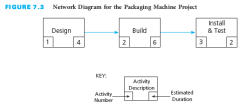Figure 5.3 depicts three activities leading directly into “Dress Rehearsal.” “Practice Skit” has an EF of day 5, “Make Costumes” has an EF of day 10, and “Make Props” has an EF of day 4.

    -   “Dress Rehearsal” cannot start until all three of these activities are finished, so the latest of the EFs for these three activities determines the ES for “Dress Rehearsal.”

    -   The latest of the three EFs is day 10—the earliest finish time for “Make Costumes.”

    -   Therefore, “Dress Rehearsal” cannot start any earlier than day 10. That is, its ES must be day 10 or later.

    -   Even though “Practice Skit” and “Make Props” may finish sooner than “Make Costumes,” “Dress Rehearsal” cannot start because the network dependent relationships indicate that all three activities must be finished before “Dress Rehearsal” can start.

-   Figure 5.4 shows the forward calculations for the consumer market study project.

    -   The project estimated start date is 0.

    -   Therefore, the earliest “Identify Target Consumers” can start is time 0, and the earliest it can finish is 3 days later (because it's estimated duration is 3 days).

    -   When “Identify Target Consumers” is finished on day 3, “Develop Draft Questionnaire” can start. It has an estimated duration of 10 days, so its ES is day 3 and its EF is day 13.

    -   When “Develop Draft Questionnaire” is finished on day 13, “Pilot-Test Questionnaire” can start. It has an estimated duration of 20 days, so its ES is day 13 and its EF is day 33.

    -   When “Pilot-Test Questionnaire” is finished on day 33, “Review Comments & Finalize Questionnaire” can start. It has an estimated duration of 5 days, so its ES is day 33 and its EF is day 38.

    -   When “Review Comments & Finalize Questionnaire” is finished on day 38, “Prepare Mailing Labels,” "Print Questionnaire," "Develop Data Analysis Software," and "Develop Software Test Data" can start. The ES for each is 38. “Prepare Mailing Labels,” has an estimated duration of 2 days, so its EF is day 40. "Develop Data Analysis Software" has an estimated duration of 10 days, so its EF is day 48. "Develop Data Analysis Software" has an estimated duration of 12 days, so its EF is day 50. "Develop Software Test Data" has an estimated duration of 2 days, so its EF is day 40.

    -   When “Prepare Mailing Labels” and "Print Questionnaire" are finished, “Mail Questionnaire & Get Responses” can start. The later of the two EF times for “Prepare Mailing Labels” and "Print Questionnaire" is 48. “Mail Questionnaire & Get Responses” has an estimated duration of 65 days, so its ES is day 48 and its EF is day 113.

    -   When "Develop Data Analysis Software" and "Develop Software Test Data" are finished, “Test Software” can start. The later of the two EF times for “Develop Data Analysis Software" and "Develop Software Test Data" is 50. "Test Software" has an estimated duration of 5 days, so its ES is day 50 and its EF is day 55.

    -   When “Mail Questionnaire & Get Responses” and "Test Software" are finished, “Input Response Data” can start. The later of the two EF times for “Mail Questionnaire & Get Responses” and "Test Software" is 113. "Input Response Data" has an estimated duration of 7 days, so its ES is day 113 and its EF is day 120.

    -   When “Input Response Data” is finished on day 120, “Analyze Results” can start. It has an estimated duration of 8 days, so its ES is day 8 and its EF is day 128.

    -   When “Analyze Results” is finished on day 128, “Prepare Report” can start. It has an estimated duration of 10 days, so its ES is day 128 and its EF is day 138.

    -   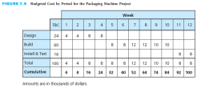The required completion time is 130 days. Day 138 days is 8 days beyond the required completion time.

    -   Figure 5.5 depicts the ES and EF times for the consumer market study project in a schedule table.

### B. Latest Start and Finish Times

-   Latest finish time (LF) is the latest time by which a specific activity must be completed in order for the entire project to be finished by its required completion time. It is calculated on the basis of the project required completion time and the estimated durations of succeeding activities.

-   Latest start time (LS) is the latest time by which a specific activity must be started in order for the entire project to be finished by its required completion time. It is calculated by subtracting the activity’s estimated duration from the activity’s latest finish time:

-   LS = LF – Estimated Duration

-   Calculate backward through the network diagram from the end of the project to the beginning of the project

-   Rule 2: The latest finish time for a specific activity must be the same as or earlier than the earliest of all the latest start times of all the activities emerging directly from that specific activity.

-   Figure 5.6 shows two activities emerging directly from “Print Posters & Brochures.”

    -   This project must be completed by day 30. Therefore, “Distribute Posters” must be started by day 20 because it has an estimated duration of 10 days, and “Mail Brochures” must be started by day 25 because it has an estimated duration of 5 days.

    -   The earlier of these two LSs is day 20. Therefore, the latest that “Print Posters & Brochures” can finish is day 20, so that “Distribute Posters” can start by day 20.

    -   Even though “Mail Brochures” does not have to start until day 25, “Print Posters & Brochures” must finish by day 20 or else the whole project will be delayed. If “Print Posters & Brochures” does not finish until day 25, then “Distribute Brochures” will not be able to start until day 25. Because “Distribute Brochures” has an estimated duration of 10 days, it will not finish until day 35, which is 5 days beyond the project required completion time.

-   Figure 5.7 shows the backward calculations for the consumer market study project.

    -   The required completion time for the project is 130 working days. Therefore, the latest that “Prepare Report,” the last activity, can finish is day 130, and the latest that it can start is day 120 because its estimated duration is 10 days.

    -   In order for “Prepare Report” to start on day 120, the latest that “Analyze Results” can finish is day 120. If the LF for “Analyze Results” is day 120, then its LS is day 112 because its estimated duration is 8 days.

    -   In order for “Analyze Results” to start on day 112, the latest that “Input Response Data” can finish is day 112. If the LF for “Input Response Data” is day 112, then its LS is day 105 because its estimated duration is 7 days.

    -   In order for “Input Response Data” to start on day 105, the latest that “Mail Questionnaire & Get Responses” and "Test Software" can finish is day 105. If the LF for “Mail Questionnaire & Get Responses” is day 105, then its LS is day 40 because its estimated duration is 65 days. If the LF for "Test Software"” is day 105, then its LS is day 100 because its estimated duration is 5 days.

    -   In order for “Mail Questionnaire & Get Responses” to start on day 40, the latest that “Prepare Mailing Labels” and "Print Questionnaire" can finish is day 40. If the LF for “Prepare Mailing Labels” is day 40, then its LS is day 38 because its estimated duration is 2 days. If the LF for “Print Questionnaire” is day 40, then its LS is day 30 because its estimated duration is 10 days.

    -   In order for “Test Software” to start on day 100, the latest that "Develop Data Analysis Software" and "Develop Software Test Data" can finish is day 40. If the LF for “Develop Data Analysis Software” is day 100, then its LS is day 88 because its estimated duration is 12 days. If the LF for “Develop Software Test Data” is day 100, then its LS is day 98 because its estimated duration is 2 days.

    -   Look at “Review Comments & Finalize Questionnaire.” In order for the four activities emerging from this activity to start by their LS times (so that the project can finish by its required completion time of 130 days), “Review Comments & Finalize Questionnaire” must be finished by the earliest LS of all four activities, according to Rule 2. The earliest of the four LSs is day 30, the latest time by which “Print Questionnaire” must start. Therefore, the latest that “Review Comments & Finalize Questionnaire” can finish is day 30. If the LF for “Review Comments & Finalize Questionnaire” is day 30, then its LS is day 25 because its estimated duration is 5 days.

    -   In order for “Review Comments & Finalize Questionnaire” to start on day 25, the latest that “Pilot-Test Questionnaire” can finish is day 25. If the LF for “Pilot-Test Questionnaire” is day 25, then its LS is day 5 because its estimated duration is 20 days.

    -   In order for “Pilot-Test Questionnaire” to start on day 5, the latest that “Develop Draft Questionnaire” can finish is day 5. If the LF for “Develop Draft Questionnaire” is day 5, then its LS is day –5 because its estimated duration is10 days.

    -   In order for “Develop Draft Questionnaire” to start on day –5, the latest that “Identify Target Consumers” can finish is day –5. If the LF for “Input Response Data” is day –5, then its LS is day –8 because its estimated duration is 3 days.

    -   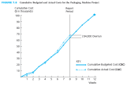The consumer market study project must start 8 days earlier than the planned start date in order to finish in the required 130 days.

    -   Figure 5.8 depicts the schedule table with the LS and LF values added to the table.

### C. Total Slack

-   Total slack is sometimes called float.

-   Total slack is the difference between EF time of last activity and the project required completion time.

-   Calculate total slack for each of the activities by finding the difference between the EF of the activity and the LF of the activity, or the difference between the ES and the LS of the activity.

    -   Negative slack indicates a lack of slack over the entire project and the amount of time an activity must be accelerated to complete the project by the required completion time.

    -   Positive slack indicates the maximum amount of time the activities on a particular path can be delayed without jeopardizing on-time completion of the project.

    -   If the total slack is zero, the activities on the path do not need to be accelerated but cannot be delayed.

-   Unnumbered image 5a depicts a project to remove old wallpaper and put up new wallpaper. The total completion time is 20 days. The tasks take 15 days (7 + 5 + 3). The project has 5 days of slack.

### D. Critical Path

-   This longest path in the overall network diagram is called the critical path.

-   One way to determine which activities make up the critical path is to find those that have the least slack.

-   Figure 5.9 depicts the Total Slack for each of the activities in the consumer market study project. Those with –8 as the total slack are the activities on the critical path.

-   Figure 5.10 depicts the critical path through the network diagram for the consumer market study project.

-   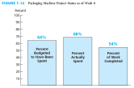Figure 5.11 depicts the change in the critical path if the estimated duration of the Mail Questionnaire & Get Responses task is reduced from 65 days to 55 days. Note that the tasks on the critical path now have a total slack of 2, the least amount of slack in the project.

### E. Free Slack

-   Free slack is the amount of time a specific activity can be postponed without delaying the earliest start time of its immediately succeeding activities.

-   Calculate free slack by finding the lowest of the values of total slack for all the activities entering into a specific activity and then subtracting it from the values of total slack for the other activities also entering into that same activity.

-   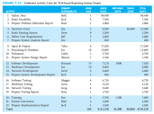Example: Activities 7 and 8 are predecessors for Activity 10 in Figure 5.10. The values of total slack for Activities 7 and 8 are 50 and 60 days, respectively. The lesser of these two values is 50 days. Therefore, Activity 8, “Develop Software Test Data,” has a free slack of 10 days (60 – 50 = 10) and can slip by up to that amount without delaying the earliest start time of Activity 10, “Test Software.”

### F. Bar Chart Format

-   A Gantt chart is a bar chart tool for planning and scheduling.

-   Activities are listed on the left-hand side, and a time scale is shown along the bottom or the top.

-   The estimated duration for each activity is indicated by a bar spanning the period during which the activity is expected to be accomplished.

-   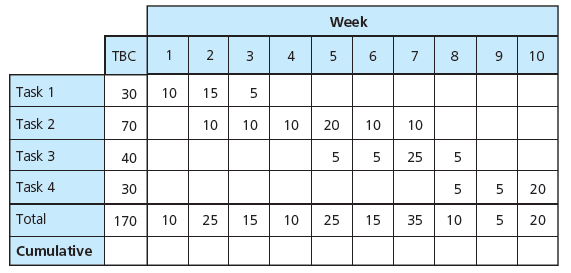A column indicating who is responsible for each task can be added to the chart.

-   Figure 5.12 depicts a bar chart for the consumer market study project.

-   Project management software can automatically generate a time-scaled bar chart from the schedule table that is based on the network diagram.

-   A traditional bar chart does not graphically display the dependent relationships of activities. Be sure to create the network diagram and connect the bars in the Gantt chart with arrows to show relationships.

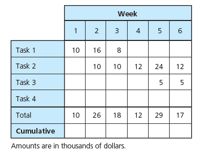6. Project Control Process
-----------------------------------------------------------------------------------

-   Figure 5.13 illustrates the steps in the project control process.

-   The project control process starts with establishing a baseline plan that shows how the project scope will be accomplished on schedule and within budget.

-   Once the customer and the contractor or project team agree on this baseline plan, the project work can be performed.

-   Then it is necessary to monitor the progress to ensure that everything is going according to the plan.

-   The project control process involves regularly gathering data on project performance, comparing actual performance to planned performance, and taking corrective action immediately if actual performance is behind planned performance.

-   This process must occur regularly throughout the project.

    -   Establish regular reporting meetings to compare actual to planned progress.

    -   Gather data on actual performance.

    -   Record information about changes to the project scope, schedule, and budget.

-   The key to effective project control is measuring actual progress and comparing it to planned progress on a timely and regular basis and immediately taking any needed corrective action.

-   Project management is a proactive approach to controlling a project to ensure that the project objective is accomplished, even when things do not go according to plan.

7. Effects of Actual Schedule Performance
-----------------------------------------

-   Some activities will be completed on time, some will be finished ahead of schedule, and others will be finished later than scheduled.

-   The actual finish times (AFs) of completed activities will determine the earliest start and earliest finish times for the remaining activities in the network diagram, as well as the total slack.

-   Figure 5.14 depicts the planned and actual performance of a project.

    -   Part (a) of Figure 5.14 is a network diagram for a simple project. It shows that the earliest the project can finish is day 15 (the sum of the estimated durations of the three activities, 7 + 5 + 3). Since the required completion time is day 20, the project has a total slack of +5 days. Suppose that Activity 1, “Remove Old Wallpaper,” is actually finished on day 10, rather than on day 7 as planned, because it turns out to be more difficult than anticipated.

    -   See part (b) of Figure 5.14. This means that the earliest start and finish times for activities 2 and 3 will be 3 days later than on the original schedule. Because “Remove Old Wallpaper” is actually finished on day 10, the ES for “Patch Walls” will be day 10 and its EF will be day 15. Following through with the forward calculations, we find that “Put Up New Wallpaper” will have an ES of day 15 and an EF of day 18. Comparing this new EF of the last activity to the required completion time of day 20, we find a difference of 2 days. The total slack got worse—it changed in a negative direction, from +5 days to +2 days. This example illustrates how the actual finish times of activities have a ripple effect, altering the remaining activities’ earliest start and finish times and the total slack.

8. Incorporate Changes into Schedule 
-------------------------------------

-   Throughout a project, changes may occur that have an impact on the schedule.

-   Changes might be initiated by the customer or the project team, or they might be the result of an unanticipated occurrence.

-   Changes requested early in the project may have less impact on schedule and budget than if they are requested later in the project.

-   When the customer requests a change, the contractor or project team should estimate the impact on the project schedule and budget and then obtain customer approval before proceeding. If the customer approves the proposed revisions to the project schedule and budget, then any additional activities, revised estimated durations, and revised estimated resources and associated costs should be incorporated into the project schedule and budget.

-   With respect to the project schedule, changes can result in the addition or deletion of activities, resequencing of activities, changes to estimated durations for specific activities, or a new required completion time for the project.

9. Update Project Schedule 
---------------------------

-   An updated project schedule can be generated regularly that forecasts whether the project will finish ahead of or behind its required completion time.

-   Once data have been collected on the actual finish times of completed activities and the effects of any project changes, an updated project schedule can be calculated.

    -   Earliest start and finish times for the remaining, uncompleted activities are calculated by working forward through the network, but they are based on the actual finish times of completed activities and the estimated durations of the uncompleted activities.

    -   The latest start and finish times for the uncompleted activities are calculated by working backward through the network.

-   The network diagram in Figure 5.15 incorporates completed activities and changes.

    -   1. Completed activities:

        -   a. Activity 1, “Identify Target Consumers,” actually finished on day 2.

        -   b. Activity 2, “Develop Draft Questionnaire,” actually finished on day 11.

        -   c. Activity 3, “Pilot-Test Questionnaire,” actually finished on day 30.

    -   2. Project changes:

        -   a. It was discovered that the database to be used to prepare the mailing labels was not up to date. A new database needs to be purchased before the mailing labels can be prepared. This new database was ordered on day 23. It will take 21 days to get it from the supplier.

        -   b. A preliminary review of comments from the pilot test of the questionnaire indicates that substantial revisions to the questionnaire are required. Therefore, the duration estimate for Activity 4 needs to be increased from 5 days to 15 days.

-   Figure 5.16 shows the updated schedule.

    -   Note that the total slack for the critical path is now –5 days, instead of the +2 days in the baseline schedule in Figure 5.11. The anticipated project completion time is now day 135, which is beyond the required completion time of 130 days.

10. Control Schedule
--------------------

-   Schedule control requires four steps:

    -   1. Analyzing the schedule to determine which areas may need corrective action

    -   2. Deciding what specific corrective actions should be taken

    -   3. Revising the plan to incorporate the chosen corrective actions

    -   4. Recalculating the schedule to evaluate the effects of the planned corrective actions

-   If the planned corrective actions do not result in an acceptable schedule, these steps need to be repeated.

-   A concentrated effort to accelerate project progress must be applied to the paths with negative slack.

    -   Activities that are near-term (that is, in progress or to be started in the immediate future).

    -   Activities that have long estimated durations

-   The amount of slack should determine the priority with which these concentrated efforts are applied.

-   A change in the estimated duration of any activity on that path will cause a corresponding change in the slack for that path.

-   Eliminating negative slack by reducing durations of activities will require a trade-off in the form of an increase in costs or a reduction in scope.

11. Scheduling for Information Systems Development
--------------------------------------------------

-   Scheduling the development of an information system is a challenging process. It is often done in a haphazard manner, and as a result a large number of IS projects are finished much later than originally promised or never finished at all.

-   Among the common problems that often push IS development projects beyond their required completion time are:

    -   Failure to identify all user requirements

    -   Failure to identify user requirements properly

    -   Continuing growth of project scope

    -   Underestimates of the learning curves for new software packages

    -   Incompatible hardware

    -   Logical design flaws

    -   Poor selection of software

    -   Failure to select the best design strategy

    -   Data incompatibility issues

    -   Failure to perform all phases of the SDLC

### A. An IS Example: Internet Applications Development for ABC Office Designs (Continued)

-   Figure 5.17 depicts a list of activities, immediate predecessors, and estimated durations for the web-based reporting system project.

-   The project is required to be completed in 50 days, and it needs to be started as soon as possible.

-   Figure 5.18 depicts the ES and EF times for each activity.

-   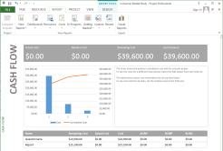Figure 5.19 depicts the LS and LF times for each activity.

-   Figure 5.20 depicts the project schedule table with the calculated total slack values for each activity.

-   Figure 5.21 shows the critical path for the development project. Beth and her team must determine a way to reduce the development time by 9 days, request that the project completion date be extended from 50 to 59 days, or find some compromise.

-   After extensive discussions with upper management, in which she stressed the importance of developing the system right the first time and not having to rush through some critical phases of the SDLC, Beth convinced her superiors to extend the project completion time to 60 days.

-   Beth and her team proceeded with the project and completed activities 1 through 6:

    -   Activity 1, “Gather Data,” actually finished on day 4.

    -   Activity 2, “Study Feasibility,” actually finished on day 4.

    -   Activity 3, “Prepare Problem Definition Report,” actually finished on day 5.

    -   Activity 4, “Interview Users,” actually finished on day 10.

    -   Activity 5, “Study Existing System,” actually finished on day 15.

    -   Activity 6, “Define User Requirements,” actually finished on day 18.

    -   The team then discovered that, by using some reusable software for the database, they could reduce the estimated duration of Activity 9, “Processing & Database,” from 10 days to 8 days.

-   Figure 5.22 depicts the updated network diagram.

-   Figure 5.23 depicts the updated project schedule. Note that the critical path has now been reduced to zero with the updates and changes.

12. Project Management Information Systems
------------------------------------------

-   Almost all project management information systems allow you to perform the scheduling functions identified in this chapter.

-   The software will also calculate ES, EF, LS, and LF times, total and free slack, and the critical path, all with a click of the mouse. It is important, however, for the project manager to understand what these terms are and what the calculations mean.

-   Virtually all project management information systems allow you to perform the control functions identified in this chapter. Specifically, while an activity is in progress or once an activity has been completed, you can enter current information into the system and the software will automatically revise the project schedule.

13. Agile Project Management
----------------------------

-   Agile project management is an approach to reduce product development time while minimizing risk through continuous interaction between the customer and small self-organizing teams that produce increments of working product features in short time iterations while rapidly adapting to changes in requirements.

-   The roles of the participants involved in the scrum approach include

    -   A product owner, also referred to as the customer representative, is responsible for defining the customer requirements and product features and for ensuring that the development team delivers an end product with the required features.

    -   The development team develops, delivers, and demonstrates working product increments (portions or modules of the overall end product that is being developed) for specific product features or requirements during a fixed timeframe, called a sprint, also referred to as an iteration.

    -   A Scrum master is a facilitator for the Scrum development process during a sprint whose primary job is to take actions to remove or reduce any obstacles, barriers, or constraints that are impeding progress of the development team toward accomplishing their work tasks and that may negatively impact the successful production and demonstration of a deliverable working product increment by the end of the sprint time.

-   The agile project management process includes

    -   Establishing the rationale, description, funding amount, and target completion date for the final end product (deliverable) and authorizing the project.

    -   Defining the product requirements and creating an ordered product backlog of prioritized specific requirements and product features.

    -   At the beginning of each sprint the product owner and the development team have a sprint planning meeting to select a set of requirements or features from the top of the product backlog that will be released to the team and that can be produced and demonstrated by the team during the fixed timeframe for the sprint cycle.

    -   At the start of each day the development team has a daily Scrum meeting, also referred to as the daily standup as these meetings are usually limited to 15 minutes. Each team member is expected to come prepared to state what they did the previous day, what they plan to do today, and any obstacles that are impeding their work.

    -   At the end of the sprint, there is a sprint review meeting at which the development team reviews the work that has been accomplished as well as which items were not completed.

    -   At the end of the sprint, there is also a sprint retrospective meeting during which the Scrum team, including the product owner, evaluates performance during the sprint regarding what went well and what could be improved in future sprints.

14. Critical Success Factors
----------------------------

-   The person who will be responsible for performing the activity should estimate the duration for that activity. This generates commitment from the person.

-   The estimated duration for an activity must be based on the types and quantities of resources required to perform the activity.

-   Activity estimated durations should be aggressive yet realistic.

-   Activities should not be longer in estimated duration than the time intervals at which the actual progress will be reviewed and compared to planned progress.

-   Project management is a proactive approach to controlling a project to ensure that the project objective is accomplished even when things do not go according to plan.

-   Once the project starts, it is important to monitor progress to ensure that everything is going according to plan.

-   The key to effective project control is measuring actual progress and comparing it to planned progress on a timely and regular basis and taking any needed corrective action immediately.

-   The key to effective schedule control is to address any paths with negative or deteriorating slack values aggressively as soon as they are identified. A concentrated effort to accelerate project progress must be applied to these paths.

-   The amount of negative slack should determine the priority for applying these concentrated efforts.

-   When attempting to reduce the duration of a path of activities that has negative slack, focus on activities that are near-term and on activities that have long estimated durations.

-   Addressing schedule problems early will minimize their negative impact on scope and budget.

-   If a project falls too far behind, getting it back on schedule becomes more difficult, and usually requires spending more money or reducing the scope or quality.

-   If corrective actions are necessary, decisions must be made regarding a trade-off of scope, time, and cost.

-   A regular reporting period should be established for comparing actual progress to planned progress.

-   The shorter the reporting period, the better the chances of identifying problems early and taking corrective actions.

-   During each reporting period, data on actual performance and information on changes to the project scope, schedule, and budget need to be collected in a timely manner and used to calculate an updated schedule and budget.

15. Summary
-----------

-   The scheduling function depends on the planning function.

-   The estimated types and quantities of resources required for an activity together with the availability of those resources will influence the estimated duration for how long it will take to perform the activity.

-   The estimated duration for each activity must be the total elapsed time—the time for the work to be done plus any associated waiting time.

-   The estimate should be aggressive yet realistic.

-   It may be easier to estimate the durations for near-term activities, but as the project progresses, the project team can progressively elaborate the estimated the durations as more information is known or becomes clear to allow for more accurate estimated durations.

-   A project schedule provides a timetable for each activity and shows the earliest start (ES) and earliest finish (EF) times and the latest start (LS) and latest finish (LF) times for each activity.

-   The total slack for a particular path of activities through the network is common to and shared among all activities on that path.

-   The critical path is the longest (most time-consuming) path of activities in the network diagram.

-   The key to effective project control is measuring actual progress and comparing it to planned progress on a timely and regular basis and taking any needed corrective action immediately.

-   Actual progress—whether faster or slower than planned—will have an effect on the schedule of the remaining, uncompleted activities of the project.

-   Any type of change—whether initiated by the customer, the contractor, the project manager, a team member, or an unanticipated event—will require a modification to the plan in terms of scope, schedule, and/or budget.

-   Schedule control involves four steps: analyzing the schedule to determine which areas may need corrective action, deciding what specific corrective actions should be taken, revising the plan to incorporate the chosen corrective actions, and recalculating the schedule to evaluate the effects of the planned corrective actions.

-   One of the most important factors in effective scheduling is estimating activity durations that are as realistic as possible.

Questions
---------

1. Why does the scheduling function depend on the planning function? Which one must be done first? Why?

A schedule is a timetable for a plan and cannot be established until the plan has been developed.

2. Describe what an activity estimated duration is. How is it determined?

The duration estimate for each activity is the total elapsed time for the work to be done plus any associated waiting time. An activity’s duration estimate must be based on the quantity of resources expected to be used on the activity. The estimate should be aggressive, yet realistic. A Beta distribution using most likely, pessimistic, and optimistic times can be used.

3. Why might a contractor prefer to state a project completion time in terms of number of days after the project starts rather than a specific date? Give some examples of instances when this would be appropriate.

This is helpful in case the start of the project is delayed for some reason, such as an unexpected snowstorm delaying the start of a construction project.

4. Refer to Figure 5.4. Why is the earliest start time for “Review Comments & Finalize Questionnaire” day 33? Why is the earliest finish time day 38?

The task can’t start until its predecessor is finished, which is day 33. It has a duration of 5, so it will finish at day 38.

5. Refer to Figure 5.7. Why is the latest start time for “Mail Questionnaires & Get Responses” day 40? Why is the latest finish time day 105?

Because its predecessor’s latest start time is day 105, it must finish by day 105. It has a duration of 65, so it must start by day 40.

6. Describe the different types of project slack. How is each calculated?

Total slack is the amount of time an activity’s earliest finish time can be delayed without delaying succeeding tasks beyond their latest finish times. If it is positive, you have extra time that can be used if needed. If it is negative, the activity needs to be completed by its latest finish time or the project completion will be delayed.

Slack = LF – EF or Slack = LS – ES

Calculate free slack by finding the lowest of the values of total slack for all the activities entering into a specific activity, and then subtracting it from the values of total slack for the other activities also entering into that same activity.

7. Why is it important to determine the critical path of a project? What happens if activities on this path are delayed? What happens if activities on this path are accelerated?

If any activity on the critical path is delayed, the whole project will be delayed, so it is important to know what the critical path is. If any of these activities are accelerated, the project completion date will also be accelerated.

8. From your experience, describe how you have used a project control process. If you did not use continual monitoring of the progress, how would this have helped improve the project’s success?

Specific answers will vary. Answers should include setting a baseline for the project plan and monitoring and controlling the actual project progress.

9. Why should a project have a regular reporting period? Should all projects have the same reporting period? Why or why not? What types of data should be collected during each reporting period?

The team should establish a regular reporting period so team members can compare actual progress to planned progress and deal with any discrepancies as early as possible. The period depends on the complexity or duration of the project. It may be daily, weekly, bi-weekly, or monthly.

Two kinds of data need to be collected:

-   Data on actual performance. This includes the actual time that activities were started and/or finished and the actual costs expended and committed.

-   Information about any changes to the project scope, schedule, and budget.

10. Who can initiate changes to a project schedule? Describe why and when changes would occur in a project. How are the network diagram and schedule updated to reflect the changes?

Changes might be initiated by the customer or the project team, or they might be the result of an unanticipated occurrence. A change might be initiated in order to add an activity, eliminate an activity or modify some aspect of an activity. Changes can occur at any time throughout the project; however, if they are requested early in the project, they may have less impact on cost and schedule. Specific examples will vary for describing why and when changes would occur in a project. Answers for how the network diagram and schedule are updated should include a recalculation of ES, EF, LS, and LF for the project.

11. Describe how you would apply the four steps of schedule control to a project. If the project needs to be accelerated, what kinds of activities would be the primary focus? Why?

Schedule control requires four steps:

1. Analyzing the schedule to determine which areas may need corrective action

2. Deciding what specific corrective actions should be taken

3. Revising the plan to incorporate the chosen corrective actions

4. Recalculating the schedule to evaluate the effects of the planned corrective actions

Specific examples will vary. Answers will depend upon the project example. Accelerate near term and longer duration activities that are on the critical path.

12. Why is the scheduling of IS projects so challenging? What are some of the common problems that push IS projects beyond their due dates?

Scheduling for IS is often done in a haphazard manner, and thus a large percentage of IS projects are finished much later than originally promised or never finished at all. One of the most important factors in effective scheduling is arriving at activity duration estimates that are as realistic as possible. Among the common problems that often push IS development projects beyond their required completion time are:

-   Failure to identify all user requirements

-   Failure to properly identify user requirements

-   Continuing growth of project scope

-   Underestimates of learning curves for new software packages

-   Incompatible hardware

-   Logical design flaws

-   Poor selection of software

-   Failure to select the best design strategy

-   Data incompatibility issues

-   Failure to perform all phases of the SDLC

13. Calculate the ES, EF, LS, and LF times and the slack for each activity in the figure below and identify the critical path for the project. Can the project be completed in 40 weeks? Assume that Activity A actually finished at 3 weeks, Activity B actually finished at 12 weeks, and Activity C actually finished at 13 weeks. Recalculate the expected project completion time. Which activities would you focus on in order to get the project back on schedule?

|          |     |     |     |     |     |     |
|----------|-----|-----|-----|-----|-----|-----|
| Activity | ED  | ES  | EF  | LS  | LF  | TS  |
| A        | 2   | 0   | 2   | 4   | 6   | 4   |
| B        | 10  | 2   | 12  | 6   | 16  | 4   |
| C        | 8   | 2   | 10  | 7   | 15  | 5   |
| D        | 15  | 2   | 17  | 8   | 23  | 6   |
| E        | 7   | 12  | 19  | 16  | 23  | 4   |
| F        | 20  | 10  | 30  | 15  | 35  | 5   |
| G        | 12  | 19  | 31  | 23  | 35  | 4   |
| H        | 5   | 31  | 36  | 35  | 40  | 4   |

Yes, the project can be completed within 40 weeks. With the current estimates, it will take 36 weeks. The longest path in the network is:

A – B – E – G – H.

|          |     |     |     |     |     |     |     |
|----------|-----|-----|-----|-----|-----|-----|-----|
| Activity | ED  | ES  | EF  | LS  | LF  | TS  | AF  |
| A        | 2   |     |     |     |     |     | 3   |
| B        | 10  |     |     |     |     |     | 12  |
| C        | 8   |     |     |     |     |     | 13  |
| D        | 15  | 3   | 18  | 8   | 23  | 5   |     |
| E        | 7   | 12  | 19  | 16  | 23  | 4   |     |
| F        | 20  | 13  | 33  | 15  | 35  | 2   |     |
| G        | 12  | 19  | 31  | 23  | 35  | 4   |     |
| H        | 5   | 33  | 38  | 35  | 40  | 2   |     |

The project can still be completed within 40 weeks; however, the expected completion has slipped from 36 to 38 weeks. If there is a need to speed it back up, attention should be given to Activity F.

14. Calculate the ES, EF, LS, and LF times and the slack for each activity in the figure below, and identify the critical path for the project. Can the project be completed in 30 weeks? Assume that “Systems Analysis” actually finished at 8 weeks, “Design Input & Output” actually finished at 15 weeks, and “Design Database” actually finished at 19 weeks. Recalculate the expected project completion time. Which activities would you focus on in order to get the project back on schedule?

|                   |     |     |     |     |     |     |
|-------------------|-----|-----|-----|-----|-----|-----|
| Activity          | ED  | ES  | EF  | LS  | LF  | TS  |
| 1. Prob. Def.     | 2   | 0   | 2   | -5  | -3  | -5  |
| 2. Sys. Analysis  | 5   | 2   | 7   | -3  | 2   | -5  |
| 3. Design I/O     | 3   | 7   | 10  | 6   | 9   | -1  |
| 4. Design DB      | 15  | 7   | 22  | 2   | 17  | -5  |
| 5. Develop Input  | 8   | 10  | 18  | 11  | 19  | 1   |
| 6. Develop Output | 10  | 10  | 20  | 9   | 19  | -1  |
| 7. Develop DB     | 2   | 22  | 24  | 17  | 19  | -5  |
| 8. Test System    | 6   | 24  | 30  | 19  | 25  | -5  |
| 9. Implement      | 5   | 30  | 35  | 25  | 30  | -5  |

No, this project cannot be completed within 30 weeks. With the current estimates, it will take 35 weeks. The most critical path is:

1 – 2 – 4 – 7 – 8 – 9.

|                  |     |     |     |     |     |     |     |
|------------------|-----|-----|-----|-----|-----|-----|-----|
| Activity         | ED  | ES  | EF  | LS  | LF  | TS  | AF  |
| 1. Prob. Def.    | 2   |     |     |     |     |     |     |
| 2. Sys. Analysis | 5   |     |     |     |     |     | 8   |
| 3. Design I/O    | 3   |     |     |     |     |     | 15  |
| 4. Design DB     | 15  |     |     |     |     |     | 19  |
| 5. Dev. Input    | 8   | 15  | 23  | 11  | 19  | -4  |     |
| 6. Dev. Output   | 10  | 15  | 25  | 9   | 19  | -6  |     |
| 7. Dev. DB       | 2   | 19  | 21  | 17  | 19  | -2  |     |
| 8. Test System   | 6   | 25  | 31  | 19  | 25  | -6  |     |
| 9. Implement     | 5   | 31  | 36  | 25  | 30  | -6  |     |

The project has slipped even further. With the current estimates, it will take 36 weeks. Attention should be given to all activities since they all have negative slack. However, the path 6-8-9 is the most critical.

15. Calculate the ES, EF, LS, and LF times and the slack for each activity in the figure below, and identify the critical path for the project. Can the project be completed in 30 weeks? Assume that Activity A actually finished at 5 weeks and Activity B actually finished at 5 weeks. Recalculate the expected project completion time. Which activities would you focus on in order to get the project back on schedule?

|          |     |     |     |     |     |     |
|----------|-----|-----|-----|-----|-----|-----|
| Activity | ED  | ES  | EF  | LS  | LF  | TS  |
| A        | 3   | 0   | 3   | 2   | 5   | 2   |
| B        | 5   | 0   | 5   | -2  | 3   | -2  |
| C        | 18  | 3   | 21  | 5   | 23  | 2   |
| D        | 7   | 5   | 12  | 3   | 10  | -2  |
| E        | 10  | 5   | 15  | 5   | 15  | 0   |
| F        | 5   | 12  | 17  | 10  | 15  | -2  |
| G        | 8   | 17  | 25  | 15  | 23  | -2  |
| H        | 2   | 25  | 27  | 23  | 25  | -2  |
| I        | 9   | 17  | 26  | 16  | 25  | -1  |
| J        | 5   | 27  | 32  | 25  | 30  | -2  |

No, this project cannot be completed within 30 weeks. With the current estimates, it will take 32 weeks. The most critical path in the network is:

B – D – F – G – H – J.

|          |     |     |     |     |     |     |     |
|----------|-----|-----|-----|-----|-----|-----|-----|
| Activity | ED  | ES  | EF  | LS  | LF  | TS  | AF  |
| A        | 3   |     |     |     |     |     | 5   |
| B        | 5   |     |     |     |     |     | 5   |
| C        | 18  | 5   | 23  | 5   | 23  | 0   |     |
| D        | 7   | 5   | 12  | 3   | 10  | -2  |     |
| E        | 10  | 5   | 15  | 5   | 15  | 0   |     |
| F        | 5   | 12  | 17  | 10  | 15  | -2  |     |
| G        | 8   | 17  | 25  | 15  | 23  | -2  |     |
| H        | 2   | 25  | 27  | 23  | 25  | -2  |     |
| I        | 9   | 17  | 26  | 16  | 25  | -1  |     |
| J        | 5   | 27  | 32  | 25  | 30  | -2  |     |

The project is still 2 weeks behind the scheduled completion date. Attention should be given to activities D – F – G – H – J.

Internet Exercises
------------------

Assign the Internet Exercises to your students as homework or complete them together in a computer lab.

***The following exercise is an update of the Internet Exercise initially printed in Gido & Clements’* Successful Project Management, *Fifth Edition. It has been uploaded to the companion website.***

> 1. Search the web for project schedule. Describe at least three sites that you find. Search with additional terms such as tools and control. List the terms that you have added and describe at least three sites that you find. Here’s a link to [Google.](http://www.google.com/)
>
> 2. For exercises 2 through 5, visit the website for [Project Smart](http://www.projectsmart.co.uk/). Explore the site. What information does it provide?
>
> *Project Smart is a project management resource that helps managers at all levels to improve their performance by reviewing the knowledge base of materials provided and using the methods and tools presented. Project Smart contains links to articles, white papers, methods, tools, templates, events, forums, books, and a glossary.*
>
> 3. Click on the link for "[Articles](http://www.projectsmart.co.uk/articles.html)" and explore the articles on the page or within the Article Categories. Provide a one-page summary.
>
> *Articles are categorized by topics such as project planning, scheduling, and Microsoft Project.*
>
> 4. Click on the "Forums" link. Search for discussions related to project scheduling by entering specific terms such as slack, critical path, or duration. Describe what you find.
>
> *Searches completed with too general of terms will not result in any articles. Searches must be completed with more specific terms.*
>
> 5. Click on the "Methods & Tools" link and explore the collection of methods and tools presented. Provide a one-page summary.
>
> *A number of methods and tools are available to guide project managers through a collection of essential project management skills, methods, tools, and competencies that help improve the probability of project success.*

Case Study \#1 A Not-For-Profit Medical Research Center
-------------------------------------------------------

This is an open-ended case study. The students have the opportunity to be very creative on this one. Encourage that creativity.

### Answers to Case Questions

Answers will vary from student to student for each question.

1. Develop an estimated duration for each activity.

Responses should use the list of tasks developed in chapter 4 and include the estimated duration for each task.

2. Using a project start time of 0 (or May 15) and a required project completion time of 180 days (or November 15), calculate the ES, EF, LS, and LF times and total slack for each activity. If your calculations result in a project schedule with negative total slack, revise the project scope, activity estimated durations, and/or sequence or dependent relationships among activities to arrive at an acceptable baseline schedule for completing the project within 180 days (or by November 15). Describe the revisions you made.

Responses could be presented in a network diagram or in the schedule table format. The project should finish in 180 days. If the original plan is not completed by 180 days, the responses should describe what tasks were revised to meet the required completion date.

3. Determine the critical path and identify the activities that make up the critical path.

Responses can be presented in a list of activity names, highlighted in the network diagram, or highlighted in the schedule table.

4. Produce a bar chart (Gantt Chart) based on the ES and EF times from the schedule in item 2.

The bar chart can be drawn in a table or using a project management information system like Microsoft Project. Suggest the students to include arrows to show the dependencies of the bars.

### Group Activity

Form groups of three or four members. Have each group perform the above tasks. Allow each group to present their answers.

Case Study \#2 The Wedding
--------------------------

This is an open-ended case study. The students have the opportunity to be very creative on this one. Encourage that creativity.

### Answers to Case Questions

Answers will vary from student to student for each question.

1. Develop an estimated duration for each activity.

Responses should use the list of tasks developed in chapter 4 and include the estimated duration for each task.

2. Using a project start time of 0 (or January 1) and a required project completion time of 180 days (or June 30), calculate the ES, EF, LS, and LF times and total slack for each activity. If your calculations result in a project schedule with negative total slack, revise the project scope, activity estimated durations, and/or sequence or dependent relationships among activities to arrive at an acceptable baseline schedule for completing the project within 180 days (or by June 30). Describe the revisions you made.

Responses could be presented in a network diagram or in the schedule table format. The project should finish in 180 days. If the original plan is not completed by 180 days, the responses should describe what tasks were revised to meet the required completion date.

3. Determine the critical path and identify the activities that make up the critical path.

Responses can be presented in a list of activity names, highlighted in the network diagram, or highlighted in the schedule table.

4. Produce a bar chart (Gantt Chart) based on the ES and EF times from the schedule in item 2.

The bar chart can be drawn in a table or using a project management information system like Microsoft Project. Suggest the students to include arrows to show the dependencies of the bars.

### Group Activity

Form groups of three or four members. Have each group perform the above tasks. Allow each group to present their answers.

Optional Supplemental Activities
--------------------------------

1.  Have students read the real-world vignettes.

2.  Ask each student to develop a work breakdown structure, a responsibility matrix, and a network diagram for a project he or she has worked on. Have students work through the problem manually and then in Microsoft Project. Let them comment on the difference in effort between working the problem manually and using a project management information system.

3.  Assign students to read the chapter and answer all the Reinforce Your Learning questions and the questions at the end of the chapter.

4.  Show some of the videos from the 4PM site in class to have students comment on what they see and how it compares to what they have read in the text book.

5.  \*\*\* Now is the time to start a term project if you are assigning one.

Appendix 1: Probabilistic Activity Durations
============================================

A. Activity Duration Estimates
------------------------------

-   With projects for which there is a high degree of uncertainty about the activity duration estimates, it is possible to use three estimates for each activity:

    -   Optimistic time (to) is the time in which a particular activity can be completed if everything goes perfectly well.

    -   Most likely time (tm) is the time in which a particular activity can most frequently be completed under normal conditions.

    -   Pessimistic time (tp) is the time in which a particular activity can be completed under adverse circumstances.

-   Establishing three time estimates makes it possible to take uncertainty into account when estimating how long an activity will take.

B. The Beta Probability Distribution 
-------------------------------------

-   In network planning, when we use three time estimates for each activity, we assume they follow a beta probability distribution.

-   Calculate the expected duration using the following formula:

    -   te = (to + 4(tm) + tp)/6

-   Assume the optimistic time for an activity is 1 week, the most likely time is 5 weeks, and the pessimistic time is 15 weeks. The expected duration for this activity is

    -   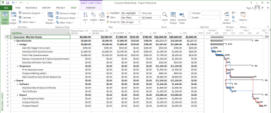te = (1 + 4(5) + 15)/6 = 6 weeks

-   Figure 5.24 depicts the beta probability distribution.

C. Probability Fundamentals 
----------------------------

-   Network planning in which three time estimates are used for each activity can be considered a stochastic, or probabilistic, technique, since it allows for uncertainty.

-   Any technique that uses only one time estimate is considered to be a deterministic technique. If only one time estimate is used for each activity, probability calculations cannot be made.

-   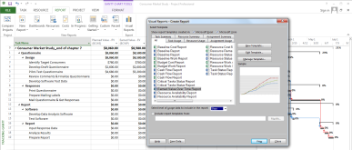The central limit theorem of probability theory states that this total probability distribution is not a beta probability distribution but a normal probability distribution. Figure 5.26 depicts the normal probability distribution.

-   The variance for the beta probability distribution of an activity is found with the following formula:

    -   Variance = *σ*2 = ((tp – to)/6)2

-   Note that the variance of the normal distribution is the sum of the variances of the beta distribution.

-   The standard deviation, *σ*, is another measure of the dispersion of a distribution and is equal to the square root of the variance.

-   The total probability distribution of all the activities on the critical path of a network diagram is a normal distribution, with a mean equal to the sum of the individual activity expected durations and a variance equal to the sum of the individual activity variances.

-   Review the example presented in the book. Figures 5.28, 5.29, and 5.30 depict the example.

D. Calculating Probability
--------------------------

-   To find the probability of actually completing a project before its required completion time, we use the following formula:

    -   Z = (LF – EF)/*σ*t

-   The elements in this formula are:

    -   LF is the required completion time (latest finish) for the project.

    -   EF is the earliest expected finish time for the project (mean of the normal distribution).

    -   *σ*t is the standard deviation of the total distribution of the activities on the longest (or slowest) path leading to project completion.

-   In the above equation, Z measures the number of standard deviations between EF and LF on the normal probability curve.

-   Review the example presented in the book. This is the example begun in Figure 5.28. Use Table 5.1 to determine the percent chance for the Z calculated for the example.

Questions
---------

1. True or false: In order to calculate the probability of finishing a project by its required completion time, it is necessary to have three time estimates for each activity and the required completion time for the project.

True.

2. What are the expected duration, variance, and standard deviation for an activity whose three time estimates are to = 2, tm = 14, and tp = 14?

Expected duration = \[2 + 4(14) + 14\] / 6

= 72 / 6

= 12

Variance = \[(14 - 2)/6\]2 = 4.0

Standard deviation = 2.0

3. Which of the following is not a measure of the dispersion, or spread, of a distribution: variance, mean, or standard deviation?

The mean is not a measure of dispersion.

4. The earliest expected finish time for a project is 138 days, and its required completion time is 130 days. What is the probability of completing the project before its required time if *σ*t (the standard deviation of the total distribution of the activities on the longest path) is 6?

Z = (130 – 138) / 6 = –1.33

Using Table 5.1, the probability of completing the project between 130 and 138 days is 40.824%. To determine the probability of completing the project before 130 days, you need to subtract 0.40824 from 0.5000. Therefore, there is a 9.176% probability of completing the project by its required completion time of 130 days.

Appendix 2: Microsoft Project
=============================

The Appendix in this chapter introduces Microsoft Project. Have the students produce the displays that are shown in the chapter.

Figure 5A.1 depicts the duration data for the project. The time can be entered in as m for minutes, h for hours, d for days, w for weeks, or mon for months. The duration time needs to be to the level that the project task can be monitored and controlled. The default time duration is days. The project title in the first row serves as a summary of the total time necessary for the project.

Figure 5A.2 depicts the schedule table for the project. Microsoft Project automatically calculates the ES, EF, LS, and LF for the project. Other tables are available on the Tables menu. Have the students explore the different types of tables. The information presented in the tables and the choices of table types are dependent upon the view prior to choosing the table.

Figure 5A.3 depicts the Gantt chart with the highlighted critical path in red. The highlighting of the critical path is important to help show the tasks that, if delayed, would delay the completion of the project.

Figure 5A.4 depicts the critical task report that shows information about each of the tasks on the critical path. This is a valuable report for communication with the project team about the tasks on the critical path. Reports are now accessed on the Reports ribbon. Use the menu on the Report ribbon to select the type of report necessary to display the summary information about the project. Have students examine the different reports that can be generated.

Figure 5A.5 depicts the change in the schedule of the Mail Questionnaire & Get Responses task from 65 days to 55 days. This change was made to reduce the project duration. The total time for the project was 138 days. The reduction of time for the task from 65 to 55 days reduces the total time to 128 days.

Figure 5A.6 depicts the input screen within the General tab in the Task Information window. The General tab is used to record the task progress. Entering information about the actual performance of the tasks permits other analysis to be done on the schedule and costs.

Figure 5A.7 depicts the insertion of a new manually scheduled activity. In some projects, the project team defines a new task that needs to be completed for the project. The new task is entered by clicking on the task name for the row of the task that will be below the new task. Microsoft Project will automatically adjust the task numbers and the predecessor numbers.

Figure 5A.8 depicts the updated predecessors on the task list after adding a new task. Note that Microsoft Project has automatically adjusted the task numbers and the predecessor numbers.

Figure 5A.9 depicts the tracking table. The tracking table shows how the project is progressing relative to the baseline that was set. If the baseline was not set, then Microsoft Project will not have anything to compare for the tracking table calculations. The percentages display the amount of completion for the tasks and the summary tasks.

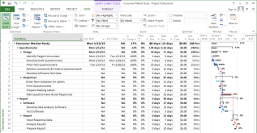Figure 5A.10 depicts the tracking Gantt. Each of the bars has two bars. One is for the baseline plan. The other is for the actual progress of the project. This report shows the effects of changes to the project for tasks that are completed early, late, or on time.

Figure 5A.11 depicts the variance table. The variance table shows the start and finish of each activity and summary task, the baseline start and finish, and the variance of the start and finish. This variance table evaluates the impact on project completion of changes in the task start dates.
