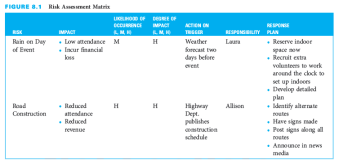
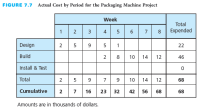
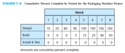

# Chapter 6 #

The consideration of resources adds another dimension to planning and scheduling. It is necessary to estimate the types and quantities of resources required to perform each activity. These resources can include people, materials, equipment, tools, facilities, and so forth. A resource requirements plan illustrates the expected utilization of resources by time period during the time span of the project.

In many projects, the quantities of the various types of resources available to perform the project activities are limited. Several activities may require the same resources at the same time, and there may not be sufficient resources available to satisfy all the demands. In a sense, these activities are competing for the use of the same resources. If sufficient resources are not available when required, some activities may have to be delayed until a later time when resources are available for them. Therefore, resources can constrain the project schedule. They can also be a constraint to completing the project within budget if it is determined that additional resources are needed to complete the project by its required completion time. This chapter covers several approaches to incorporating resource considerations into the project plan and schedule.

Based upon this chapter, students will become familiar with

-   Taking resource constraints into account when developing a network diagram

-   Determining the resource requirements plan for a project

-   Leveling the use of resources within the required time frame of the project

-   Determining the shortest project schedule with the limited resources available

Learning Outcomes
=================

After studying this chapter, the learner should be able to:

-   Create a network diagram that takes resource constraints into account

-   Prepare a resource requirements plan

-   Explain resource leveling

-   Discuss resource-limited scheduling

Project Management Knowledge Areas from PMBOK® Guide
====================================================

Concepts in this chapter support the following Project Management Knowledge Areas of

*A Guide to the Project Management Body of Knowledge (PMBOK*® *Guide*):

-   Project Human Resource Management

Teaching Strategies
===================

1.  The two vignettes in this chapter reinforce the need think creatively about the constraints of a project. Projects have the potential to make innovative changes and must include concern for the community, culture, and socioeconomic characteristics of the stakeholders.

2.  In the first vignette, project teams need to consider sources of funding and support to impact the potential 10-fold increase in the development of healthcare apps that could reduce the number of deaths attributed to chronic diseases. Students could consider how to propose the potential projects to funders or what type of team would be needed to develop the apps.

3.  The second vignette portrays the complexity of projects around the world to transform regions to have positive community impact, economic viability, and sustainable ecological footprints. Project and program managers will be in charge of teams that must address a number of project constraints and complex systems. Students could review the success of these projects and find other projects that are similar.

4.  Good project management utilizes techniques that work in complex situations. The solution to a project problem can be as simple as a spreadsheet. Solutions are not always complex.

5.  An example of resource leveling is presented in the text. Images are given to help show the results of the process for leveling resources.

6.  Ask the students why it is important to consider resources when planning and managing a project. Will the number of resources available affect the completion date? If you had 2 experienced people building a house, would it take as long as if you had 10 experienced people building a house? What would happen if you started with 10 and half of them quit?

7.  Describe examples you have encountered when resources were limited and a project needed to be done.

Lecture Notes
=============

1. Real-World Project Management Examples
-----------------------------------------

### Vignette A: The New House Call

-   Project Need -- An estimated 60 percent of deaths around the globe are attributed to chronic diseases such as heart disease and cancer. A primary goal of the projects is to help reduce the occurrence of chronic diseases.

-   Project -- The solution expected is development of mobile healthcare apps.

-   Budget -- The prognosis is a surge from $1.2 billion USD in 2011 to $11.8 billion USD in 2018 for expenditures related to mobile healthcare app development and implementation.

This potential ten-fold in investment will require an increase in resources to shape the healthcare everywhere future. Project teams are addressing the current mobile healthcare app requirements and are planning for future use. Reduction in healthcare costs and incidence of chronic diseases is expected by having patients make the new house call to their healthcare professionals with a mobile healthcare app. Maybe the new statement will be, ‘An app a day keeps the doctor away.’

### Vignette B: Industrial Sites Get a New Look

-   Shanghai, China

    -   An inactive quarry

    -   300-room luxury hotel that extends 200 feet below the surface

    -   With “little or no precedent for an ‘upside-down’ hotel on a cliff face,” according to Baet, the obstacles are interesting. The resources necessary to complete the project extend beyond people and materials; they include the site-specific issues that can add to the schedule and the budget. Toxic chemicals, machinery needing disassembling, fire-safety, seismic activity, and storm-water management require resources for their mitigation.

-   Baumholder, Germany

    -   Closing of a U.S. military base

    -   Repurpose abandoned military sites around the world , into civic spaces that respect the communities’ physical, cultural, and socioeconomic characteristics

    -   “Former military installations offer an opportunity to re-envision the future of a community and positive social good,” states T. Luke Young, program coordinator at Architecture for Humanity, San Francisco, California, USA, the company sponsoring a contest for project designs.

-   London

    -   abandoned industrial district

    -   Spotlighted during the 2012 Summer Olympics, the transformation employed numerous human and material resources to upgrade rail lines, clean contaminated soil, build more than 2,800 homes, and create a vibrant region for use after the closing ceremonies

The goals for these creative projects in unlikely spaces included positive community impact, economic viability, and sustainable ecological footprints. Constraints for the planning for these and other similar projects do not follow standard requirements for resources. Complexity, vision, and site-specific solutions are challenging to project teams and investors as the clients and design teams generate sustainable and responsible solutions. The field of project management successfully applies techniques to address the complexity and will continue to lead in the field of opportunities for out of the ordinary projects and for helping former industrial sites get a new look.

2. Resource-Constrained Planning
--------------------------------

-   Network diagrams illustrate the technical constraints among activities.

-   Activities are drawn in a serial relationship because, from a technical standpoint, they must be performed in that sequence.

-   Figure 6.1 depicts three house-building activities that must be done serially.

-   In addition to showing the technical constraints among activities, the resource-constrained planning can also take into account resource constraints. The sequence of activities can be drawn to reflect the availability of a limited quantity of resources.

-   Figure 6.2(a) depicts that, technically, three activities could be performed concurrently; that is, there is no technical reason why the start of any one of these activities should depend on the completion of any other one.

-   Figure 6.2(b) shows what happens if there is only one person available to do all the painting. This displays how a network diagram could be prepared if there are resource constraints.

3. Resource Requirements Plan
-----------------------------

-   A resource requirements plan illustrates the expected utilization of resources by time period during the time span of the project.

-   If resources are to be considered in planning, it’s necessary to indicate the amounts and types of resources needed to perform each activity.

-   Figure 6.3 depicts the estimated resource requirements for the consumer market study project. Although the project takes 128 days, the amount of work days is 90 days.

-   The resource profile for painters is illustrated in Figure 6.4 and shows an uneven utilization of painters.

-   Figure 6.5 depicts the resource requirements for the painters based upon the network diagram in Figure 6.4.

-   Figure 6.6 depicts the resource utilization of the painters based upon the network diagram in Figure 6.4. The pattern is uneven.

-   Sometimes it’s preferable to have a more uniform, or level, application of resources. This helps to avoid having to pay resources overtime or for time when work is not being performed.

-   Resource utilization charts based on each activity’s earliest start time are said to be based on an as-soon-as-possible (ASAP) schedule.

-   Resource utilization charts based on each activity’s latest start time are said to be based on an as-late-as-possible (ALAP) schedule.

4. Resource Leveling
--------------------

-   Resource leveling, or smoothing, is a method for developing a schedule that attempts to minimize the fluctuations in requirements for resources.

-   This method levels the resources so they are applied as uniformly as possible without extending the project schedule beyond the required completion time.

-   The start of noncritical activities is delayed beyond their earliest start times (but not beyond their latest start times) in order to maintain a uniform level of required resources.

-   Activities can be delayed only to the point where all their positive slack is used up, because any further delays would extend the project beyond its completion time.

-   Figure 6.5 can be leveled. In Figure 6.5, “Bathroom” could be delayed up to 2 days, “Basement Rooms” could be delayed up to 8 days, and “Bedrooms” could be delayed up to 6 days—all without extending the project completion time.

    -   Two alternative actions could be taken:

        -   Alternative 1. Delay the activity with the most positive slack—“Basement Rooms” (+8 days slack)—by 6 days so it will start after “Bedrooms” is finished. Figures 6.7 and 6.8 depict the resource-leveled requirements plan for the painting project and the resource-leveled utilization for the painters with alternative 1.

        -   Alternative 2. Delay “Bedrooms” so it will start on day 4, after “Basement Rooms” has been completed.

-   Project management information systems ease the complexity of generating a resource-leveled schedule and resource requirements graphs and tables.

5. Resource-Limited Scheduling
------------------------------

-   Resource-limited scheduling is a method for developing the shortest schedule when the number or amount of available resources is fixed and cannot be exceeded.

-   This method will extend the project completion time if necessary in order to keep within the resource limits.

-   When several activities need the same limited resource at the same time, the activities with the least slack have first priority.

-   The lower priority activities get delayed. The delaying of activities may delay the project.

-   Figure 6.9 illustrates what would happen if only a limited number of painters—two—were available to do the painting project.

    -   Figure 6.10 shows that, as the project starts, three activities require a total of four painters.

    -   Because “First-Floor Rooms” has a slack of 0, the two painters will be allocated to the first-floor rooms and will continue to be assigned to that activity until it has been finished.

    -   This first-resource allocation is shown in Figure 6.11, with the project completion going from day 12 to day 14.

    -   The second resource allocation is shown in Figure 6.12 with the project completion date going from day 14 to day 16.

    -   The third resource allocation is shown in Figure 6.13 with the project completion date remaining at day 16.

6. Resource Requirements for Information Systems Development
------------------------------------------------------------

-   Information systems development includes people, hardware, software, data, and network resources as the five basic required resources.

-   Each of these resources is assigned to the activities in order to complete the tasks.

-   The more accurately the activities are assessed for the needed resources, the more likely it is that the development projects can be completed on time.

-   The majority of IS projects assign resources to multiple tasks at the same time without considering over-allocation and the conflict resources face to complete the project work.

-   The over-allocation forces the resources to be overextended and increases the probability of project failure.

### A. An IS Example: Internet Applications Development for ABC Office Designs (Continued)

Recall from Chapters 4 and 5 that Beth Smith of ABC Office Designs was assigned as project manager for the development of a Web-based reporting system project. Beth has identified the major tasks to be completed and the project schedule. Management has agreed to the project team’s plan for 60 days to complete the development. Beth has 14 staff members on the project team. Each staff member has been assigned to have primary responsibility for at least one activity, as shown in the responsibility assignment matrix for the project (Figure 4.11).

-   Beth Smith begins her resource requirements plan by seeking input from the person assigned primary responsibility for each of the major tasks that need to be accomplished.

-   Beth noticed that if all the resources are allocated at 100 for primary and support roles, resources will be over-allocated.

-   Beth worked with the resource with primary responsibility to determine the level of effort needed by the support resources and to remove the over-allocations.

    -   Joe and Gerri would be assigned as overtime if Hannah and Maggie needed additional help for Software Development.

    -   Beth and Jim agree that Hannah and Gerri could be removed from Training during the two days of work necessary to complete System Conversion if Beth could not complete the work alone. The plan is to have more training events when Hannah and Gerri are available if Beth needs them.

-   Beth completed the removal of the over-allocations. The report shows the total amount of work is 2,040 hours, planned to be completed in 60 days. Figure 6.14 depicts the resources assigned to the project, including material and cost resources.

7. Project Management Information Systems
-----------------------------------------

Project management information systems provide excellent features for handling resource considerations within a project.

-   Most systems allow you to create and maintain a list of resources that can be accessed by all the tasks within a project.

-   The list typically allows you to store the resource name, maximum quantity of units available, standard and overtime rates, and costs.

-   In addition, because the expenses for resources can be accrued at different times throughout a project, most systems allow you to create charges for a resource at the beginning of its use, at fixed intervals, or at the end of the project.

-   Each resource can also be assigned a calendar of its availability over a specified period of time.

-   Resource over-allocations are resolved either manually or with the automatic process, whereby the information system determines the best solution and whether the project can be delayed to solve the over-allocation.

8. Critical Success Factors
---------------------------

-   Resources can constrain the project schedule because the quantities of various types of resources available to perform the project activities may be limited.

-   It is necessary to estimate the types and quantities of resources required to perform each activity.

-   If sufficient resources are not available when required, some activities may have to be delayed until a later time when resources become available to perform the activities.

-   Resource leveling or smoothing is a method for developing a schedule that attempts to minimize the fluctuations in requirements for resources. It levels the resources so that they are applied as uniformly as possible without extending the project schedule beyond its required completion time.

-   Resource-limited scheduling is a method for developing the shortest schedule when the quantity of resources is fixed. It will extend the project completion time if necessary.

9. Summary
----------

-   The consideration of resources adds another dimension to planning and scheduling; resources can constrain a project.

-   Resources can include people, materials, equipment, tools, facilities, and so forth.

-   A resource requirements plan illustrates the expected utilization of resources by time period during the time span of the project.

-   Resource leveling, or smoothing, is a method for developing a schedule that attempts to minimize the fluctuations in requirements for resources when the project completion time is fixed.

-   Resource-limited scheduling is a method for developing the shortest schedule when the quantity of available resources is fixed and may extend the project completion time in order to keep within the resource limits.

Questions
---------

1. Give at least 10 examples of resources.

Specific examples will vary. Possibilities include: people, equipment, machines, tools, facilities and space. Often, students will respond with resources for a specific project rather than more general terms.

2. Think about a project that you are currently working on or have worked on. List all of the resources used in this project.

Specific answers will vary. Responses should include more specific descriptions than people, machines, equipment, tools, facilities, and space.

3. Discuss why resources need to be considered when developing a schedule.

Resources need to be considered when developing a schedule because if sufficient resources are not available, some activities may have to be rescheduled for a later time when resources are available.

4. Describe how resources can be considered when creating a network diagram.

If three resources are needed and are available simultaneously, the three activities can be performed simultaneously. However, if three resources are needed but are available only sequentially, the three activities must be done sequentially. The diagram should be drawn to reflect these relationships.

5. What are technical constraints? Give some examples.

Technical constraints are activities that must be performed in a certain order to meet the project objective. For example, three house-building activities—build foundation, build frame, and put on roof—must be done in that sequence. Other specific examples will vary.

6. What are resource constraints? Give some examples.

Resource constraints are resources that are limited and available in a particular timeframe. For example, if three rooms of a house need to be painted, but only one painter is available, the project is constrained by the “personnel” resource. Other specific examples will vary.

7. Describe what is meant by resource leveling or smoothing. Why is it used? When is it used?

Resource leveling, or smoothing, is a method for developing a schedule that attempts to minimize the fluctuations in requirements for resources. This method levels the resources so that they are applied as uniformly as possible without extending the project schedule beyond the required completion time. It is used when there is variation in resource requirements among activities.

8. Does resource leveling keep a project on schedule? If so, how?

Resource leveling keeps the project on schedule because activities are delayed only to the point where all their positive slack is used up, since any further delays would cause the project to extend beyond the project due date.

9. Describe what is meant by resource-limited scheduling. Why is it used? When is it used?

Resource-limited scheduling is a method for developing the shortest schedule when the number or amount of available resources is fixed and cannot be exceeded. This method will extend the project completion time if necessary in order to keep within the resource limits.

10. Does resource-limited scheduling keep a project on schedule? If so, how?

Resource-limited scheduling does not necessarily keep a project on schedule. It may extend the schedule in order to keep within the resource limits.

11. Using the following figure, perform resource leveling. Assume that each task can be performed independently of the other tasks.

One possible solution would be:

Step 1 – Delay Task 1 to start after Task 2 is complete.

Step 2 – Delay Task 5 to start after Task 4 is complete.

The new dates would be:

Task 2 days 1 – 3 (1 worker)

Task 3 days 1 – 3 (3 workers)

Task 1 days 4 – 7 (2 workers)

Task 4 days 4 – 7 (2 workers)

Task 5 days 8 – 10 (1 worker)

Task 6 days 8 – 10 (3 workers)

This would allow 4 workers to be busy at all times and would not extend the completion time of the project.

12. Using the figure in question 11, perform resource-limited scheduling. Assume that you have only three workers available at any given time. What is the new completion date for the project?

One possible solution would be:

Step 1 – Delay Task 1 to start after Task 3 is complete.

Delay Task 2 to start after Task 3 is complete.

Step 2 – Delay Task 1 to start after Task 2 is complete.

Step 3 – Delay Task 5 to start after Task 2 is complete.

Step 4 – Delay Task 1 to start after Task 4 is complete.

Step 5 – Delay Task 6 to start after Task 1 is complete.

The new dates would be:

Task 3 days 1 – 3 (3 workers)

Task 2 days 4 – 6 (1 worker)

Task 4 days 4 – 7 (2 workers)

Task 5 days 7 – 9 (1 worker)

Task 1 days 8 – 11 (2 workers)

Task 6 days 12 – 14 (3 workers)

The project completion date goes from day 10 to day 14.

Internet Exercises
------------------

Assign the Internet Exercises to your students as homework or complete them together in a computer lab.

The search for resource leveling and resource-limited scheduling yields results including definitions, recommendations on how to complete each technique, examples of each, and tools for leveling and scheduling. Try the search in several different search engines to see the differences.

A variety of project management software packages are available for sale and for download. The descriptions include information on how they handle resource considerations.

The Association for Project Management has a variety of resources available to the public. Additional resources are available to members. Event dates are listed in day/month/ year format.

Case Study \#1 A Not-For-Profit Medical Research Center
-------------------------------------------------------

This is an open-ended case study. The students have the opportunity to be very creative on this one. Encourage that creativity.

### Answers to Case Questions

Answers will vary from student to student for each question.

1. Using the responsibility assignments you made in Chapter 4 and the baseline schedule you developed in Chapter 5, now develop a resource requirements table (similar to Figures 6.3), for each resource, based on an as-soon-as-possible (ASAP) schedule.

If students use Microsoft Project for their case study responses, they may produce a Resource Usage report that shows the assignments for each resource for each week of the project by task. The ASAP scheduling is set for the task on the Task Information window.

### Group Activity

Divide the course participants into the same groups as for the previous chapter’s group activity. Allow each group to present their answers.

Case Study \#2 The Wedding
--------------------------

This is an open-ended case study. The students have the opportunity to be very creative on this one. Encourage that creativity.

### Answers to Case Questions

Answers will vary from student to student for each question.

1. Using the responsibility assignments you made in Chapter 4 and the baseline schedule you developed in Chapter 5, now develop a resource requirements table (similar to Figures 6.3), for each resource, based on an as-soon-as-possible (ASAP) schedule.

If students use Microsoft Project for their case study responses, they may produce a Resource Usage report that shows the assignments for each resource for each week of the project by task. The ASAP scheduling is set for the task on the Task Information window.

### Group Activity

Divide the course participants into the same groups as for the previous chapter’s group activity. Allow each group to present their answers.

Optional Supplemental Activities
--------------------------------

1.  Have students read the real-world vignettes.

2.  Ask students to read the chapter and answer all the Reinforce Your Learning questions and the questions at the end of the chapter.

3.  Have students manually solve the resource leveling and resource-limited scheduling then solve the problems in Microsoft Project.

4.  Examine the Association for Project Management website with the class and explore the resources. Let students identify what resources would be best for project managers that are at the junior level and for those more senior in project management.

Appendix: Microsoft Project
===========================

The Appendix in this chapter continues discussing Microsoft Project. Have the students produce the displays that are shown in the chapter. In Chapter 5, two files were saved. They should use the file they saved (without the actual finish times) to continue the planning. Examination for over-allocations and resource leveling should occur in the planning phase. Based on changes that occur through the project, there may be times that the project manager will need to address future over-allocations that result from the changes.

Figure 6A.1 depicts the Resource Sheet for the consumer market study project. The Resource Sheet allows you to enter information about your resources, including specific work calendars for each. Human resources are entered as Work resources. Other types of resources are entered as Material or Cost resources. The Type column of the Resource Sheet shows the type of resource as Work, Material, or Cost.

Add material and cost resources by entering the name in the Resource Name column. Select the type as material or cost in the Type column by clicking on the down arrow in the Type column for the entry. The Consumer Market Study requires two material resources and one cost resource, in addition to the four work resources.

Figure 6A.2 depicts adding notes for a resource to provide additional information. Notes are helpful for keeping track of something that is not common in the project, for adding a needed reminder to a special case, and for recording lessons learned.

Figure 6A.3 depicts adding a resource to a task. If work resources are added to a task and the task is not set to fixed duration, Microsoft Project will cue you to say whether the task length should be shortened in duration with the addition of the new work resource on the task. The name of the assigned resource will show in the Resource Names column. The number of units for material resources and the cost for cost resources is shown in brackets after the name of the material or cost resource in the Resource Names column. These can be edited in the Task Information window.

Figure 6A.4 depicts the assignment of work times to fixed-duration tasks. Summary tasks automatically change to fixed duration. Activities need to be changed if the amount of work will not extend for the entire duration of time, for example, installing concrete in a construction project. The installation may take a day and the drying may have to take a week. The activity needs to be scheduled for the installation and the drying time, but the work resource is assigned only during the installation. In the consumer market study, Steve has to wait for responses to be collected in the Mail Questionnaire & Get Responses activity.

Changing a task from Effort Driven to not effort driven allows for the entry of work time that does not equal the duration of the task. Making the change on the Task Usage sheet lets the system make the change for the specific resource within the task. This is a finer detail than if the work time is changed on the Gantt Chart entry view.

Figure 6.A.5 depicts the Task Usage sheet. Microsoft Project schedules a fraction of the work time for each day for a work resource. On the Task Usage sheet, the number of hours scheduled each day can be changed and the other fraction of time removed. The Work column will show the total time for the project that a resource is assigned to the task. The Resource Usage sheet will show summaries for the resources and the time for each task.

Figure 6A.6 depicts the Overallocated Resources Report. In the consumer market study project, Steve is overallocated. The report shows only the over-allocations in the project. The project manager and the team must decide what action to take to manage the over-allocation, whether to satisfy the over-allocation manually or automatically or to ignore it.

Figure 6A.7 depicts the team planner view of overallocated resources. The team planner shows the details of the overallocation to help with planning on how best to address the overallocation.

Figure 6A.8 depicts the Resource Leveling screen in Microsoft Project. Shown here is an automatic technique for leveling the resource. Explore the different leveling options by clicking on the Resource Leveling and then clearing the leveling and examining the next technique and its outcomes.

Figure 6A.9 depicts the change for Steve after the resource leveling has been completed. The task for Steve shifted to March 2. The shift occurs within the slack of the project. If there is no slack, the project time will be extended, causing the project to go overtime.

Figure 6A.10 depicts the Resource Usage Report. This report summarizes the work done by each resource for each task by week. The total working time for each resource is shown at the top of each week's cell for each resource. This report is helpful for communicating with other project managers who may be using these same resources; it can help reduce conflicts from over-allocating shared resources.

Figure 6A.11 depicts the resource usage sheet. The resource usage sheet displays an overview per day of the total amount of work assigned to a work resource and the number of units assigned to a material resource. Project managers use the resource usage sheet to help determine the assignments for the resources for the project.
