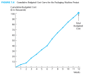
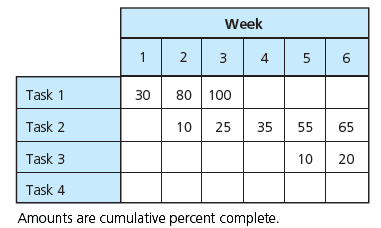

# Chapter 6 #

The consideration of resources adds another dimension to planning and scheduling. It is necessary to estimate the types and quantities of resources required to perform each activity. These resources can include people, materials, equipment, tools, facilities, and so forth. A resource requirements plan illustrates the expected utilization of resources by time period during the time span of the project.

In many projects, the quantities of the various types of resources available to perform the project activities are limited. Several activities may require the same resources at the same time, and there may not be sufficient resources available to satisfy all the demands. In a sense, these activities are competing for the use of the same resources. If sufficient resources are not available when required, some activities may have to be delayed until a later time when resources are available for them. Therefore, resources can constrain the project schedule. They can also be a constraint to completing the project within budget if it is determined that additional resources are needed to complete the project by its required completion time. This chapter covers several approaches to incorporating resource considerations into the project plan and schedule.

Based upon this chapter, you will become familiar with

-   Taking resource constraints into account when developing a network diagram

-   Determining the resource requirements plan for a project

-   Leveling the use of resources within the required time frame of the project

-   Determining the shortest project schedule with the limited resources available

Learning Outcomes
=================

After studying this chapter, the you should be able to:

-   Create a network diagram that takes resource constraints into account

-   Prepare a resource requirements plan

-   Explain resource leveling

-   Discuss resource-limited scheduling

Project Management Knowledge Areas from PMBOK® Guide
====================================================

-   Project Human Resource Management

1. Real-World Project Management Examples
-----------------------------------------

### Vignette A: The New House Call

-   Project Need -- An estimated 60 percent of deaths around the globe are attributed to chronic diseases such as heart disease and cancer. A primary goal of the projects is to help reduce the occurrence of chronic diseases.

-   Project -- The solution expected is development of mobile healthcare apps.

-   Budget -- The prognosis is a surge from $1.2 billion USD in 2011 to $11.8 billion USD in 2018 for expenditures related to mobile healthcare app development and implementation.

This potential ten-fold in investment will require an increase in resources to shape the healthcare everywhere future. Project teams are addressing the current mobile healthcare app requirements and are planning for future use. Reduction in healthcare costs and incidence of chronic diseases is expected by having patients make the new house call to their healthcare professionals with a mobile healthcare app. Maybe the new statement will be, ‘An app a day keeps the doctor away.’

### Vignette B: Industrial Sites Get a New Look

-   Shanghai, China

    -   An inactive quarry

    -   300-room luxury hotel that extends 200 feet below the surface

    -   With “little or no precedent for an ‘upside-down’ hotel on a cliff face,” according to Baet, the obstacles are interesting. The resources necessary to complete the project extend beyond people and materials; they include the site-specific issues that can add to the schedule and the budget. Toxic chemicals, machinery needing disassembling, fire-safety, seismic activity, and storm-water management require resources for their mitigation.

-   Baumholder, Germany

    -   Closing of a U.S. military base

    -   Repurpose abandoned military sites around the world , into civic spaces that respect the communities’ physical, cultural, and socioeconomic characteristics

    -   “Former military installations offer an opportunity to re-envision the future of a community and positive social good,” states T. Luke Young, program coordinator at Architecture for Humanity, San Francisco, California, USA, the company sponsoring a contest for project designs.

-   London

    -   abandoned industrial district

    -   Spotlighted during the 2012 Summer Olympics, the transformation employed numerous human and material resources to upgrade rail lines, clean contaminated soil, build more than 2,800 homes, and create a vibrant region for use after the closing ceremonies

The goals for these creative projects in unlikely spaces included positive community impact, economic viability, and sustainable ecological footprints. Constraints for the planning for these and other similar projects do not follow standard requirements for resources. Complexity, vision, and site-specific solutions are challenging to project teams and investors as the clients and design teams generate sustainable and responsible solutions. The field of project management successfully applies techniques to address the complexity and will continue to lead in the field of opportunities for out of the ordinary projects and for helping former industrial sites get a new look.

2. Resource-Constrained Planning
--------------------------------

-   Network diagrams illustrate the technical constraints among activities.

-   Activities are drawn in a serial relationship because, from a technical standpoint, they must be performed in that sequence.

-   Figure 6.1 depicts three house-building activities that must be done serially.

-   In addition to showing the technical constraints among activities, the resource-constrained planning can also take into account resource constraints. The sequence of activities can be drawn to reflect the availability of a limited quantity of resources.

-   Figure 6.2(a) depicts that, technically, three activities could be performed concurrently; that is, there is no technical reason why the start of any one of these activities should depend on the completion of any other one.

-   Figure 6.2(b) shows what happens if there is only one person available to do all the painting. This displays how a network diagram could be prepared if there are resource constraints.

3. Resource Requirements Plan
-----------------------------

-   A resource requirements plan illustrates the expected utilization of resources by time period during the time span of the project.

-   If resources are to be considered in planning, it’s necessary to indicate the amounts and types of resources needed to perform each activity.

-   Figure 6.3 depicts the estimated resource requirements for the consumer market study project. Although the project takes 128 days, the amount of work days is 90 days.

-   The resource profile for painters is illustrated in Figure 6.4 and shows an uneven utilization of painters.

-   Figure 6.5 depicts the resource requirements for the painters based upon the network diagram in Figure 6.4.

-   Figure 6.6 depicts the resource utilization of the painters based upon the network diagram in Figure 6.4. The pattern is uneven.

-   Sometimes it’s preferable to have a more uniform, or level, application of resources. This helps to avoid having to pay resources overtime or for time when work is not being performed.

-   Resource utilization charts based on each activity’s earliest start time are said to be based on an as-soon-as-possible (ASAP) schedule.

-   Resource utilization charts based on each activity’s latest start time are said to be based on an as-late-as-possible (ALAP) schedule.

4. Resource Leveling
--------------------

-   Resource leveling, or smoothing, is a method for developing a schedule that attempts to minimize the fluctuations in requirements for resources.

-   This method levels the resources so they are applied as uniformly as possible without extending the project schedule beyond the required completion time.

-   The start of noncritical activities is delayed beyond their earliest start times (but not beyond their latest start times) in order to maintain a uniform level of required resources.

-   Activities can be delayed only to the point where all their positive slack is used up, because any further delays would extend the project beyond its completion time.

-   Figure 6.5 can be leveled. In Figure 6.5, “Bathroom” could be delayed up to 2 days, “Basement Rooms” could be delayed up to 8 days, and “Bedrooms” could be delayed up to 6 days—all without extending the project completion time.

    -   Two alternative actions could be taken:

        -   Alternative 1. Delay the activity with the most positive slack—“Basement Rooms” (+8 days slack)—by 6 days so it will start after “Bedrooms” is finished. Figures 6.7 and 6.8 depict the resource-leveled requirements plan for the painting project and the resource-leveled utilization for the painters with alternative 1.

        -   Alternative 2. Delay “Bedrooms” so it will start on day 4, after “Basement Rooms” has been completed.

-   Project management information systems ease the complexity of generating a resource-leveled schedule and resource requirements graphs and tables.

5. Resource-Limited Scheduling
------------------------------

-   Resource-limited scheduling is a method for developing the shortest schedule when the number or amount of available resources is fixed and cannot be exceeded.

-   This method will extend the project completion time if necessary in order to keep within the resource limits.

-   When several activities need the same limited resource at the same time, the activities with the least slack have first priority.

-   The lower priority activities get delayed. The delaying of activities may delay the project.

-   Figure 6.9 illustrates what would happen if only a limited number of painters—two—were available to do the painting project.

    -   Figure 6.10 shows that, as the project starts, three activities require a total of four painters.

    -   Because “First-Floor Rooms” has a slack of 0, the two painters will be allocated to the first-floor rooms and will continue to be assigned to that activity until it has been finished.

    -   This first-resource allocation is shown in Figure 6.11, with the project completion going from day 12 to day 14.

    -   The second resource allocation is shown in Figure 6.12 with the project completion date going from day 14 to day 16.

    -   The third resource allocation is shown in Figure 6.13 with the project completion date remaining at day 16.

6. Resource Requirements for Information Systems Development
------------------------------------------------------------

-   Information systems development includes people, hardware, software, data, and network resources as the five basic required resources.

-   Each of these resources is assigned to the activities in order to complete the tasks.

-   The more accurately the activities are assessed for the needed resources, the more likely it is that the development projects can be completed on time.

-   The majority of IS projects assign resources to multiple tasks at the same time without considering over-allocation and the conflict resources face to complete the project work.

-   The over-allocation forces the resources to be overextended and increases the probability of project failure.

### A. An IS Example: Internet Applications Development for ABC Office Designs (Continued)

Recall from Chapters 4 and 5 that Beth Smith of ABC Office Designs was assigned as project manager for the development of a Web-based reporting system project. Beth has identified the major tasks to be completed and the project schedule. Management has agreed to the project team’s plan for 60 days to complete the development. Beth has 14 staff members on the project team. Each staff member has been assigned to have primary responsibility for at least one activity, as shown in the responsibility assignment matrix for the project (Figure 4.11).

-   Beth Smith begins her resource requirements plan by seeking input from the person assigned primary responsibility for each of the major tasks that need to be accomplished.

-   Beth noticed that if all the resources are allocated at 100 for primary and support roles, resources will be over-allocated.

-   Beth worked with the resource with primary responsibility to determine the level of effort needed by the support resources and to remove the over-allocations.

    -   Joe and Gerri would be assigned as overtime if Hannah and Maggie needed additional help for Software Development.

    -   Beth and Jim agree that Hannah and Gerri could be removed from Training during the two days of work necessary to complete System Conversion if Beth could not complete the work alone. The plan is to have more training events when Hannah and Gerri are available if Beth needs them.

-   Beth completed the removal of the over-allocations. The report shows the total amount of work is 2,040 hours, planned to be completed in 60 days. Figure 6.14 depicts the resources assigned to the project, including material and cost resources.

7. Project Management Information Systems
-----------------------------------------

Project management information systems provide excellent features for handling resource considerations within a project.

-   Most systems allow you to create and maintain a list of resources that can be accessed by all the tasks within a project.

-   The list typically allows you to store the resource name, maximum quantity of units available, standard and overtime rates, and costs.

-   In addition, because the expenses for resources can be accrued at different times throughout a project, most systems allow you to create charges for a resource at the beginning of its use, at fixed intervals, or at the end of the project.

-   Each resource can also be assigned a calendar of its availability over a specified period of time.

-   Resource over-allocations are resolved either manually or with the automatic process, whereby the information system determines the best solution and whether the project can be delayed to solve the over-allocation.

8. Critical Success Factors
---------------------------

-   Resources can constrain the project schedule because the quantities of various types of resources available to perform the project activities may be limited.

-   It is necessary to estimate the types and quantities of resources required to perform each activity.

-   If sufficient resources are not available when required, some activities may have to be delayed until a later time when resources become available to perform the activities.

-   Resource leveling or smoothing is a method for developing a schedule that attempts to minimize the fluctuations in requirements for resources. It levels the resources so that they are applied as uniformly as possible without extending the project schedule beyond its required completion time.

-   Resource-limited scheduling is a method for developing the shortest schedule when the quantity of resources is fixed. It will extend the project completion time if necessary.

9. Summary
----------

-   The consideration of resources adds another dimension to planning and scheduling; resources can constrain a project.

-   Resources can include people, materials, equipment, tools, facilities, and so forth.

-   A resource requirements plan illustrates the expected utilization of resources by time period during the time span of the project.

-   Resource leveling, or smoothing, is a method for developing a schedule that attempts to minimize the fluctuations in requirements for resources when the project completion time is fixed.

-   Resource-limited scheduling is a method for developing the shortest schedule when the quantity of available resources is fixed and may extend the project completion time in order to keep within the resource limits.
