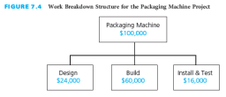
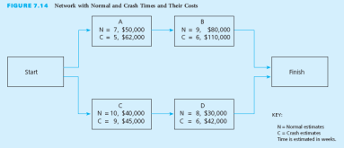
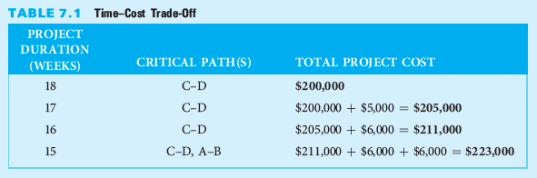
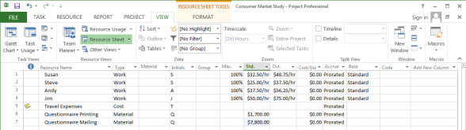
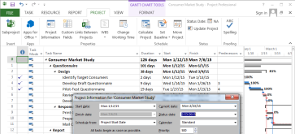

# Chapter 7 #

In addition to establishing a baseline schedule for a project, it is also necessary to develop a baseline budget. Estimates must be made of the costs for each specific activity. The project budget is determined by aggregating the estimated costs for all the activities. The budget must then be spread over the expected time span of the project to create a time-phased baseline budget that is used to analyze cost performance of the project. Once the project starts, it is important to monitor actual costs and earned value of the work performed. At regular intervals during the project, the following cost-related parameters should be monitored:

-   Cumulative actual amount spent since the start of the project

-   Cumulative earned value of the work performed since the start of the project

-   Cumulative budgeted amount planned to be spent, based on the project schedule, from the start of the project.

Comparisons must be made among these three parameters to evaluate whether the project is being accomplished within budget and whether the earned value of the work performed is in line with the actual cost expended.

If at any time during the project it is determined that the project is overrunning the budget or the value of the work performed is not keeping up with the actual cost expended, corrective action must be taken immediately. Once project costs get out of control, it will be very difficult to complete the project within budget. As you will see in this chapter, the key to effective cost control is to analyze cost performance on a timely and regular basis. Early identification of cost variances allows corrective action to be taken before the situation gets worse. Based on the actual cost expended and the earned value of the work performed, you will learn how to regularly forecast whether the entire project will be completed within budget.

Based upon this chapter, students will become familiar with

-   Estimating the costs of activities

-   Determining a time-phased baseline budget

-   Determining the earned value of the work performed

-   Analyzing cost performance

-   Forecasting project cost at completion

-   Controlling project costs

-   Managing cash flow

Learning Outcomes
=================

After studying this chapter, the learner should be able to:

-   Estimate the cost of activities

-   Aggregate the total budgeted cost

-   Develop a time-phased baseline budget

-   Describe how to accumulate actual costs

-   Determine the earned value of work performed

-   Calculate and analyze key project performance measures

-   Discuss and apply approaches to control the project budget

-   Explain the importance of managing cash flow

Project Management Knowledge Areas from PMBOK® Guide
====================================================

Concepts in this chapter support the following Project Management Knowledge Areas of

*A Guide to the Project Management Body of Knowledge (PMBOK*® *Guide*):

-   Project Cost Management

Teaching Strategies
===================

1.  The two vignettes reinforce the requirement to use lessons learned to inform the next project, increase consideration of risk management, have change control strategies, set appropriate responsibilities, have a communication plan, have procedures for addressing common issues, organize project sites, and align stakeholders. The goal is to detect and curb systematic cost underestimation and manage scope changes to avoid cost and schedule overruns.

<!-- -->

1.  Tell students a story of a project that has spent all its money but hasn't finished all the tasks. Have students determine what could have been done to avoid the situation, remedy the situation, or absorb the cost overruns.

2.  Have students use a work breakdown structure and network diagram for a project they will have to complete during the class semester to develop the costs. Have the students estimate the earned value at different time periods of the project given a scenario on how far along they have completed their projects.

3.  Have students simulate actual completion dates for the consumer market study in Microsoft Project to see how they accumulated actual costs and earned value change over time.

Lecture Notes
=============

1. Real-World Project Management Examples
-----------------------------------------

### Vignette A: Dynamic Consequences of Cost, Schedule, and Performance

DoD is the source of project management techniques and is plagued by cost overruns. A project by the US Army was analyzed using earned value techniques. The assessment led to a reduction in the scope of the project to limit the losses and have a positive outcome for the funding spent.

-   Department of Defense (DoD) projects have used project management techniques formally beginning in the 1950s within the U.S. Polaris missile development project. Critical paths were examined and managed.

-   Although there are core practices to project management and earned value calculations, it seems that managing DoD projects requires additional factors to be considered, quite possibly because of the long time span from conception to production.

    -   Half of major defense programs are not meeting costs goals and 98 projects between 2008 and 2010 experienced a growth in budget by 9 percent.

    -   Most common reasons for failure to stay on time and within budget include budget pressure, schedule pressure, and changing user requirements.

-   Examined hundreds of projects and developed a work flow process to help forecast the earned value and future costs of DoD projects more accurately

    -   To determine if the project should continue, the planned schedule and budget is compared to the actual performance and a number of ratios are calculated.

    -   Depending upon positive or negative magnitude of the ratios, a change in schedule or budget is implemented.

-   Future Combat System was designed by the U.S. Army.

    -   The U.S. Army decided that the initial project for developing a Future Combat System for the entire army was not a feasible project.

    -   The initial project budget was $130 billion.

    -   After analysis that resulted in an estimate of $210 billion with only 86 percent of the performance delivered and a potential completion date of 2022.

Earned value methods are a valuable asset in the tool set of a project manager. Using the cost estimates at completion in comparison to schedule, costs, and performance are good strategies to determine if a project should continue or be terminated. One of the most difficult decisions by a project manager is to terminate a project or limit its scope. The U.S. Army project managers made this difficult decision based on analysis of the costs, schedule, performance, and earned value.

### Vignette B: Power Transmission Project Cost Management

Canada has aging power transmission lines that are inadequate to meet the needs of the country. New lines are needed. Two project teams from western Canada provide lessons learned to new project teams to help avoid cost and schedule overruns and the problems that plagued their power transmission line projects.

-   Problems were identified by each of the western Canadian power transmission project teams.

    -   Topping both project teams’ lists of problems for their transmission line installation projects was high employee turnover, especially the turnover in the engineering and procurement aspects of the project.

    -   The continuing training of new personnel not only was a problem for engineering and procurement, a shortage of staff in general and changes in key project personnel and senior team members in the middle of the project caused milestones to not be met and increased project costs.

    -   The budgets for each project were subjected to inaccurate estimates of the work to be done by the project team and subcontractors submitted bids for work with inflated bid prices.

    -   Heavily imposed restrictions by the industry on the project team related to permits, licenses, landowners, and the environment were beyond the control of the project team yet delayed project progress as hearings had to be held and approvals obtained before work could be completed

-   The teams offered solutions to future project teams.

    -   The top rated solution suggested future teams acquire a clear understanding of the scope of work and the client’s requirements and suggested they include sufficient time to spend with the subcontractors to clarify the scope of work and requirements necessary to complete all the work needed for the subtasks.

    -   This increased planning and clarification translates into spending more time creating realistic schedule and cost estimates based upon sound conceptual design with visits to the project sites and upon budget development by lead engineers, project managers, and key project personnel

    -   The project teams recommended that future project teams should be established that completed a specific project task before they were assigned to another task

-   Using lessons learned from your prior projects will help you accurately estimate costs, budget, and schedules.

2. Estimate Activity Costs
--------------------------

The total project cost is often estimated during the initiating phase of the project or when the project charter or a proposal is prepared

-   The estimated cost for each specific activity can include the following elements:

    -   Labor -- estimated costs for the various types or classifications of people who are expected to work on the project, based on the estimated work time (not necessarily the same as the activity’s estimated duration) and the dollar labor rate for each person or classification

    -   Materials -- the estimated costs of materials that the project team or contractor needs to purchase for the project

    -   Equipment -- equipment that must be purchased as part of the project

    -   Facilities -- special facilities or additional space for the project team, for security, or for storing materials, or to build, assemble, and test the project end item (deliverable)

    -   Subcontractors and consultants -- outsourced when project teams or contractors do not have the expertise or resources to do certain project tasks

    -   Travel -- travel (other than local travel) required during the project

    -   Reserve -- also referred to as contingency, to cover unexpected situations that may come up during the project, such as items that may have been overlooked when the initial project scope was defined, activities that may have to be redone because they may not work the first time (redesigns), or a high-probability or high-impact risk that may occur

-   Figure 7.1 depicts the estimated costs for each activity in the consumer market study project.

-   It is good practice to have the person who will be responsible for the costs associated with the work make the cost estimates.

-   Historical data can be used as on the current project.

-   Cost estimates should be reasonable and realistic.

-   At the beginning of the project, it may not be possible to accurately estimate the costs for all activities. This is especially true for longer-term projects. It may be easier to estimate the costs for near-term activities, but as the project progresses, the project team can progressively elaborate the estimated costs as more information is known or becomes clear to allow for more accurate estimated costs.

3. Determine Project Budget
---------------------------

-   The project budgeting process has two steps.

    -   First, the project cost estimate is allocated to the various work packages in the project work breakdown structure.

    -   Second, the budget for each work package is distributed over the duration of the work package.

### A. Aggregate Total Budgeted Cost

-   Allocating total project costs for the various elements to the appropriate work packages will establish a total budgeted cost (TBC) for each work package.

-   There are two approaches to establishing the TBC for each work package: top-down and bottom-up.

-   Often, the sum of the initial estimated costs is greater than the amount of funds budgeted by the sponsor. Several iterations may need to be made to reduce the costs.

-   Figure 7.2 illustrates the allocation for a $600,000 project. The costs are assigned to each work package.

-   When the budgets for all the work packages are summed, they cannot exceed the total project budgeted cost.

-   Figure 7.3 and Figure 7.4 depict the network diagram and the work breakdown structure with costs assigned. This example is used throughout the remainder of this chapter.

### B. Develop Cumulative Budgeted Cost

-   Once a total budgeted cost has been established for each work package, the second step in the project budgeting process is to distribute each TBC over the duration of its work package.

-   A cost is determined for each period, based on when the activities that make up the work package are scheduled to be performed to create the time-phased budget.

-   The cumulative budgeted cost (CBC) is the amount budgeted to accomplish the work scheduled to be performed up to that point in time.

-   Figure 7.5 depicts the budgeted cost by period for the packaging machine project.

-   Figure 7.6 depicts the cumulative budgeted cost curve for the packaging machine project. The points on the graph correspond to the cumulative total in Figure 7.5.

-   The CBC for the entire project or each work package provides a baseline against which actual cost and work performance can be compared at any time during the project.

-   The cumulative budget is the standard against which actual cost is compared.

4. Determine Actual Cost
------------------------

-   Once the project starts, it’s necessary to keep track of actual cost and committed cost so they can be compared to the CBC.

### A. Actual Cost

-   To keep track of actual cost on a project, it’s necessary to set up a system to collect, on a regular and timely basis, data on funds actually expended.

-   Large projects will have charge codes for the work package numbers to determine how the actual costs compare to the planned costs.

### B. Committed Costs

-   In many projects, large dollar amounts are expended for materials or services (subcontractors, consultants) that are used over a period of time longer than one cost reporting period.

-   These committed costs need to be treated in a special way so the system periodically assigns a portion of their total cost to actual cost.

-   Committed costs are also known as commitments or encumbered costs.

-   Costs are committed when an item is ordered, even though actual payment may take place at some later time.

### C. Compare Actual Cost to Budgeted Cost

-   As data are collected on actual cost, including portions of any committed cost, they need to be totaled by work package so they can be compared to the cumulative budgeted cost.

-   Cumulative actual cost (CAC) should be calculated.

-   Figure 7.7 indicates that at the end of week 8, $68,000 has actually been expended on this project, although only $64,000 was budgeted as shown in Figure 7.5.

-   With the CAC values, it’s possible to draw a cumulative actual cost curve as shown in Figure 7.8.

5. Determine Value of Work Performed
------------------------------------

-   Consider a project for painting ten similar rooms over ten days (one room per day) for a total budgeted cost of $2,000. The budget is $200 per room.

-   At of the end of day 5, you determine that $1,000 has actually been spent, but what if only three rooms have been painted?

-   Earned value, the value of the work actually performed, is a key parameter that must be determined throughout the project.

-   Determining the earned value includes collecting data on the percent complete for each work package, and then converting this percentage to a dollar amount by multiplying the TBC of the work package by the percent complete.

-   In many cases, the estimate is subjective.

-   It’s important that the person estimating the percent complete not only assess how much work has been performed but also consider what work remains to be done.

-   For example, in the project to paint ten rooms for $2,000, if three rooms have been completed, it’s safe to say that 30 percent of the work has been performed.

-   The earned value is

    -   0.30 x $2,000 = $600

-   Figure 7.9 depicts the cumulative percent complete by period for the packaging machine project.

-   Figure 7.10 depicts the cumulative earned value by period for the packaging machine project.

-   Figure 7.11 illustrates the CBC, CAC, and CEV for the entire project.

6. Analyze Cost Performance
---------------------------

-   The following four cost-related measures are used to analyze project cost performance:

    -   TBC (total budgeted cost)

    -   CBC (cumulative budgeted cost)

    -   CAC (cumulative actual cost)

    -   CEV (cumulative earned value)

-   Plot CBC, CAC, and CEV curves on the same graph to reveal any trends toward improving or deteriorating cost performance.

-   In the packaging machine project we see that:

    -   $64,000 was budgeted through the end of week 8.

    -   $68,000 was actually expended by the end of week 8.

    -   $54,000 was the earned value of work actually performed by the end of week 8.

-   Figure 7.12 depicts the packaging machine project status as of week 8.

### A. Cost Performance Index

-   The cost performance index (CPI) is a measure of the cost efficiency with which the project is being performed. The formula for determining the CPI is

-   Cost performance index = Cumulative earned value/Cumulative actual cost

    -   CPI = CEV/CAC

-   In the packaging machine project, the CPI as of week 8 is given by

    -   CPI = $54,000/$68,000 = 0.79

-   This ratio indicates that for every $1.00 actually expended, only $0.79 of earned value was received.

-   When the CPI goes below 1.0 or gradually gets smaller, corrective action should be taken.

### B. Cost Variance

-   Another indicator of cost performance is cost variance (CV), which is the difference between the cumulative earned value of the work performed and the cumulative actual cost.

-   Cost variance = Cumulative earned value – Cumulative actual cost

    -   CV = CEV – CAC

-   In the packaging machine project, the cost variance as of week 8 is given by

    -   CV = $54,000 – $68,000 = –$14,000

-   This calculation indicates that the value of the work performed through week 8 is $14,000 less than the amount actually expended.

7. Estimate Cost at Completion
------------------------------

-   Based on analysis of actual cost, it’s possible to forecast what the total costs will be at the completion of the project or work package.

-   There are three different methods for determining the forecasted cost at completion (FCAC).

    -   The first method assumes the remaining work will be done at the same rate of efficiency as the work performed so far.

        -   Forecasted cost at completion = Total budgeted cost/Cost performance index

        -   For the packaging machine project, the forecasted cost at completion is given by:

            FCAC = $100,000/0.79 = $126,582

    -   A second method for determining the forecasted cost at completion assumes that, regardless of the efficiency rate the project or work package has experienced in the past, the remaining work will be done according to budget.

        -   Forecasted cost at completion = Cumulative actual cost + (Total budgeted cost – Cumulative earned value)

        -   For the packaging machine project, the forecasted cost at completion is given by:

            FCAC = $68,000 + ($100,000 – $54,000)

            = $68,000 + $46,000

            = $114,000

    -   A third method for determining the forecasted cost at completion is to re-estimate the costs for all the remaining work to be performed and add this re-estimate to the cumulative actual cost.

        -   FCAC = CAC + Re-estimate of remaining work to be performed

    -   Another measure is the to-complete performance index (TCPI)

        -   TCPI = (TBC – CEV)/(TBC – CAC)

            TCPI = ($100,000 − $54,000)/($100,000 − $68,000)

            = $46,000/$32,000

            = 1.44

8. Control Costs
----------------

-   The key to effective cost control is to analyze cost performance on a regular and timely basis.

-   It’s crucial that cost variances and inefficiencies be identified early so that corrective action can be taken before the situation gets worse.

-   Cost control includes the following:

    -   Analyzing cost performance to determine which work packages may require corrective action.

    -   Deciding what specific corrective action should be taken.

    -   Revising the project plan—including time and cost estimates—to incorporate the planned corrective action.

-   When evaluating work packages that have a negative cost variance, focus on taking corrective actions to reduce the costs of two types of activities:

    -   Activities that will be performed in the near term. If you put off corrective actions until some point in the distant future, the negative cost variance may deteriorate.

    -   Activities that have a large cost estimate. Taking corrective measures that reduce the cost of a $20,000 activity by 10 percent will have a larger impact than totally eliminating a $300 activity.

-   There are various ways to reduce the costs of activities.

    -   Substitute less expensive materials.

    -   Assign a person with greater expertise or more experience to perform or help with the activity.

    -   Reduce the scope or requirements.

    -   Increase productivity through improved methods or technology.

-   In many cases, there will be a tradeoff—reducing cost variances will require a reduction in project scope or a delay in the project schedule.

-   The key to effective cost control is aggressively addressing negative cost variances and cost inefficiencies as soon as they are identified.

9. Manage Cash Flow
-------------------

-   It is important to manage the cash flow on a project.

-   Managing cash flow means making sure sufficient payments are received from the customer in time so that you have enough money to cover the costs of performing the project.

-   The key to managing cash flow is to ensure that cash comes in faster than it goes out.

-   The contractor might try to negotiate payment terms that require the customer to do one or more of the following:

    -   Provide a down payment at the start of the project.

    -   Make equal monthly payments based on the expected duration of the project.

    -   Provide frequent payments, such as weekly or monthly payments rather than quarterly payments.

-   The worst scenario from the contractor’s point of view is to have the customer make only one payment at the end of the project.

-   The contractor can control its outflow of cash by delaying payment until it is due.

10. Cost Estimating for Information Systems Development
-------------------------------------------------------

-   Chapter 4 defined the information system (IS) as a computer-based system that accepts data as input, processes the data, and produces information required by users.

-   Chapter 5 revealed that scheduling is often done in a haphazard manner, resulting in a large number of IS projects not finishing on time.

-   Chapter 6 reinforced the resource requirements planning necessary for people, hardware, software, data, and network resources.

-   This chapter addresses cost estimating in an IS project. Accurately estimating costs and including a reserve are essential in creating a realistic budget to complete the work without cost overruns. Having a good plan and schedule helps to develop cost estimates and a baseline budget.

-   Common errors in estimating costs include:

    -   Underestimating the work time necessary to complete an activity.

    -   Requiring rework to meet the user requirements.

    -   Underestimating growth in the project scope.

    -   Not anticipating new hardware purchases.

    -   Correcting flaws in excess of the reserve plan.

    -   Changing the design strategy.

    -   Increasing resources to fast-track phases of the SDLC.

A. An IS Example: Internet Applications Development for ABC Office Designs (Continued)
--------------------------------------------------------------------------------------

-   Recall from Chapters 4, 5, and 6 that Beth Smith was assigned to be the project manager by the IS Department of ABC Office Designs.

-   Chapter 5 described how Beth had scheduled the ES, EF, LS, and LF times for the activities necessary to complete the Web-based reporting system development project for ABC Office Designs.

-   Chapter 6 described how Beth and the project team planned the resources for the 60-day schedule they have to complete the project. Management approved a budget of $125,000 to complete the project and train the sales staff.

-   After confirming with the primary responsible resources that the tasks could be completed with the estimated level of effort on each task,

    -   Beth worked with the human resources team to use the hourly wage for each of the employees to determine the labor costs for each of the Web-based Reporting System project activities.

    -   Beth and the project team estimated the costs associated with traveling to complete the interviews with users ($3,000), the price of the packaged software ($500), and the costs of the training materials ($1,300).

    -   The budgeted costs of the work to complete the project were near the $125,000 limit without training the sales staff.

-   Figure 7.13 depicts the estimated activity costs for the Web-Based Reporting Development project with a 5% reserve for cost overruns, fast-tracking of the project, or increased costs of materials or travel for the interviews.

11. Project Management Information Systems
------------------------------------------

-   All costs associated with each resource in a project can be stored, and the software will calculate the budget for each work package and for the entire project.

-   Project management software usually allows the user to define different rate structures for each resource and when charges for those resources will actually be accrued.

-   Cost tables and graphs are often available to help analyze cost performance.

-   See Appendix A in the textbook for a thorough discussion of Project Management Software.

12. Critical Success Factors
----------------------------

-   Estimated activity costs must be based on the estimated activity resources.

-   The person who will be responsible for performing the activity should estimate the costs for that activity. This generates commitment from the person.

-   Cost estimates should be reasonable and realistic.

-   Once the project starts, it is important to monitor actual costs and work performance to ensure that everything is within budget.

-   A system should be established to collect, on a regular and timely basis, data on costs actually expended and committed, and the earned value (percent complete) of the work performed, so they can be compared to the cumulative budgeted cost (CBC).

-   If at any time during the project it is determined that the project is overrunning the budget, or the value of the work performed is not keeping up with the actual amount of costs expended, corrective action must be taken immediately.

-   It is important to use the time-phased cumulative budgeted cost (CBC), rather than the total budgeted cost (TBC), as the baseline against which cumulative actual cost (CAC) is compared. It would be misleading to compare the actual costs expended to the total budgeted cost, because cost performance will always look good as long as actual costs are below the TBC.

-   To permit a realistic comparison of cumulative actual cost to cumulative budgeted cost, assign portions of the committed costs to actual costs while the associated work is in progress.

-   The earned value of the work actually performed is a key parameter that must be determined and reported throughout the project.

-   For each reporting period, the percent complete data should be obtained from the person responsible for the work. It is important that the person make an honest assessment of the work performed relative to the entire work scope.

-   One way to prevent inflated percent complete estimates is to keep the work packages or activities small in terms of scope and duration. The person estimating the percent complete should assess not only how much work has been performed but also what work remains to be done.

-   The key to effective cost control is to analyze cost performance on a timely and regular basis. Early identification of cost variances (CV) allows corrective actions to be taken immediately, before the situation gets worse.

-   For analyzing cost performance, all the data collected should be as current as possible and be based on the same reporting period.

-   Trends in the cost performance index (CPI) should be monitored carefully. If the CPI goes below 1.0 or gradually decreases, corrective action should be taken.

-   As part of the regular cost performance analysis, the estimated or forecasted cost at completion (FCAC) should be calculated.

-   The key to effective cost control is to aggressively address work packages or activities with negative cost variances and cost inefficiencies as soon as they are identified. A concentrated effort must be applied to these areas. The amount of negative cost variance should determine the priority for applying these concentrated efforts.

-   When attempting to reduce negative cost variances, focus on activities that will be performed in the near term and on activities that have large estimated costs.

-   Addressing cost problems early will minimize the negative impact on scope and schedule. Once costs get out of control, getting back within budget becomes more difficult and is likely to require reducing the project scope or quality or extending the project schedule.

-   The key to managing cash flow is to ensure that cash comes in faster than it goes out.

-   It is desirable to receive payments from the customer (cash inflow) as early as possible, and to delay making payments to suppliers or subcontractors (cash outflow) as long as possible.

13. Summary
-----------

-   The total project cost is often estimated during the initiating phase of the project when the project charter or a proposal is prepared, but detailed plans are not usually prepared at that time.

-   The project budgeting process has two steps: the budget for each work package is determined, and the budget for each work package is then distributed over the expected time.

-   Aggregating the estimated costs of the specific activities for the appropriate work packages in the work breakdown structure will establish a total budgeted cost (TBC).

-   The cumulative budgeted cost (CBC) is the time-phased baseline budget that will be used to analyze the cost performance of the project.

-   At any time during the project, it is possible to forecast what the total costs will be at the completion of the project or work package based on analysis of actual cost expended and the earned value of work performed.

-   The key to effective cost control is to analyze cost performance on a regular and timely basis.

-   It is important to manage the cash flow on a project.

Questions
---------

1. Describe why it is necessary to develop a baseline budget for a project.

It is necessary to prepare a budget, or plan, for how and when funds will be spent over the duration of the project to ensure that everything is within budget.

2. List and describe items that should be included when estimating activity costs.

The cost section of a proposal may consist of elements such as the following:

-   Labor. The estimated hours and hourly rate for each person or classification.

-   Materials. The materials that need to be purchased for the project.

-   Subcontractors and consultants (if used). People who have the resources or experience to perform certain tasks that the project team cannot.

-   Equipment and facilities rental. Special equipment, tools, or facilities the contractor needs for the project.

-   Travel.

-   Reserves. An amount to cover unexpected situations that may come up during the project.

3. What does the term reserve mean? Should a reserve amount be included in a project proposal? Explain your answer.

Reserves are funds to cover unexpected situations that may occur during the project. The contractor or project team may include an amount for reserve to cover unexpected situations that may come up during the project within the estimated budget in the proposal. For example, items may have been overlooked when the project cost estimates were prepared, tasks may have to be redone because they did not work the first time, or the costs of labor (wages, salaries) or materials may escalate during a multi-year project.

4. What is the problem with making cost estimates too conservative or too aggressive?

Cost estimates should be aggressive yet realistic. If cost estimates are overly conservative, the total estimated cost for the project is likely to be more than the customer is willing to pay—and higher than that of competing contractors. On the other hand, if cost estimates are overly optimistic and some unexpected expenditures need to be made, the contractor is likely to either lose money or suffer the embarrassment of going back to the customer to request additional funds to cover cost overruns.

5. Describe the project budgeting process.

The project budgeting process has two steps. First, the project cost estimate is allocated to the various work packages in the project work breakdown structure. Second, the budget for each work package is distributed over the duration of the work package.

6. Define the following: TBC, CBC, CAC, CEV, CPI, CV, FCAC, and TCPI. How is each calculated?

-   TBC: total budgeted cost

    -   a) top-down = a portion of the total project cost is allocated to each work package.

    -   b) bottom-up = the sum of the costs of all the activities that make up that work package.

-   CBC: cumulative budgeted cost = the amount budgeted to accomplish the work scheduled to be performed up to that point in time.

-   CAC: cumulative actual cost = the amount actually spent to accomplish the work scheduled to be performed up to that point in time.

-   CEV: cumulative earned value = % complete X TBC (for the work package)

-   CPI: cost performance index = CEV/CAC

-   CV: cost variance = CEV – CAC

-   FCAC: forecasted cost at completion

    -   a) FCAC = TBC/CPI

    -   b) FCAC = CAC + (TBC – CEV)

    -   c) FCAC = CAC + Re-estimate of remaining work to do

-   TCPI: to-complete performance index = (TBC – CEV)/(TBC – CAC)

7. Why is it necessary to track actual and committed costs once a project starts?

It is necessary to tract actual and committed costs so they can be compared to the CBC, in order for the team to take corrective action before it’s too late.

8. Why is it necessary to calculate the earned value of work performed? How is this done?

It is important to calculate the earned value of work performed so that if the work performed isn’t keeping up with the actual cost, corrective action can be taken, even if the actual cost is in line with the CBC. Determining the earned value includes collecting data on the percent complete for each work package and then converting this percentage to a dollar amount by multiplying the TBC of the work package by the percent complete.

9. Give an example of calculating a cost performance index. What does it mean when the CPI is below 1.0? What does it mean when the CPI is above 1.0?

Cost performance index = CEV/CAC

If CPI is less than 1.0, it means that for every dollar expended, less than one dollar of earned value was received. If CPI is greater than 1.0, it means that for every dollar expended, more than one dollar of earned value was received.

10. What does it mean when cost variance is negative? What does it mean when cost variance is positive? When evaluating a work package with a negative cost variance, on what two types of activities should you focus? Why?

Cost variance = Cumulative earned value – Cumulative actual cost

If the CV is negative, it means the value of the work performed is less than the amount actually expended. If the CV is positive, it means the value of the work performed is more than the amount expended.

Project managers should focus on:

-   Activities that will be performed in the near term. If you put off corrective actions until some point in the distant future, the negative cost variance may deteriorate.

-   Activities that have a large cost estimate. Usually, the larger the estimated cost for an activity, the greater the opportunity for a large cost reduction.

11. What is the key to managing cash flow? How can this goal be accomplished?

The key to managing cash flow is to ensure that cash comes in faster than it goes out. This can be accomplished by asking the customer to:

-   provide a down payment at the start of the project.

-   make equal monthly payments based on the expected duration of the project.

-   provide frequent payments, such as weekly or monthly payments rather than quarterly payments.

12. a. Refer to the table below. What is the cumulative budgeted cost at the end of week 6? Amounts are in thousands of dollars.

The cumulative budgeted cost at the end of week 6 is $100,000.

b. Below is a table of actual costs. What is the cumulative actual cost at the end of week 6? Determine whether there is a cost overrun or underrun. What is causing it? Amounts are in thousands of dollars.

|            | Week |
|------------|------|
|            | 1    |
| Cumulative | 10   |

There is a cost overrun of $12,000. The actual cost of Task 1 was $34,000 while only $30,000 was budgeted for it. The actual cost so far of Task 2 is $68,000, while only $60,000 had been budgeted up to week 6. The actual cost of Task 3 is $10,000 which equals its budgeted amount at week 6.

c. Below is a table of the cumulative percentages of work completed by the end of week 6. What is the cumulative earned value of the project at the end of week 6? Is it good?

|        |     |                                 |
|--------|-----|---------------------------------|
|        |     | Cumulative Earned Value by Week |
|        | TBC | 1                               |
| Task 1 | 30  | 9                               |
| Task 2 | 70  |                                 |
| Task 3 | 40  |                                 |
| Task 4 | 30  |                                 |
| Total  | 170 | 9                               |

The cumulative earned value at the end of week 6 is only $83,500; however, $112,000 has already been spent.

d. What is the CPI at the end of week 6? What is the CV?

CPI = 83,500/112,000 = 0.7455

CV = 83,500 – 112,000 = –28,500

e. Calculate the FCAC using the first two methods described.

Method 1 – Assuming the same rate of efficiency.

FCAC = TBC/CPI

FCAC = $170,000 / 0.7455 = $228,034.87

Method 2 – Perform the remainder of the work according to budget.

FCAC = CAC + (TBC – CEV)

FCAC = $112,000 + ($170,000 – $83,500)

FCAC = $112,000 + $86,500

FCAC = $198,500

Internet Exercises
------------------

Assign the Internet Exercises to your students as homework or complete them together in a computer lab.

A number of cost analysis tools are found on the Internet. Adding the term "project management" to the search will yield results focused on cost benefit analysis for projects. Results of the cost forecasting search are centered on management in general cost forecasting. Adding the term "project management" changes the sites found to those focused on cost forecasting in project management.

ProjectSmart provides project management resources for project managers at all levels. The site features articles, presentations, and other information of interest around the world. The White Papers link contains to a number of papers on topics to help improve project management performance. The site’s articles, books, presentations, and case studies that help reinforce the project management concepts.

Case Study \#1 A Not-For-Profit Medical Research Center
-------------------------------------------------------

This case continues through to Chapter 8. Each chapter has questions to reinforce the concepts presented. Have students save their work for this case study for the work they will do in Chapter 8. This is an open-ended case study. The students have the opportunity to be very creative on this one. Encourage that creativity.

### Answers to Case Questions

Answers will vary from student to student for each question.

1. Using the schedule from Chapter 5, estimate the cost for each activity.

If using Microsoft Project, enter the rates of the work and material resources on the Resource Sheet. Assign the cost resource amount on the Task Information window for the task where the resource is assigned. Any resources that are not assigned for the duration of a work package should have a percent of effort assigned. Or the task should be changed to a fixed duration and the amount of work changed.

2. Determine the total budgeted cost for the project.

The determination of the TBC for the project is completed using the top-down or bottom-up approach. If using Microsoft Project and assigning the costs to the work packages, the approach is bottom-up.

-   a) top-down = allocates a portion of the total project cost to each work package.

-   b) bottom-up = sums the costs of all the activities that make up that work package.

3. Prepare a budgeted cost by period table (similar to Figure 7.5) and a cumulative budgeted cost (CBC) curve (similar to Figure 7.6) for the project.

In Microsoft Project, the visual report, Cash Flow report, depicts the amount of cost per quarter, week, or day and the cumulative budgeted cost curve. The Cash Flow report provides a table of the costs and the total costs per week for the project.

### Group Activity

Divide the course participants into the same groups as for the previous chapter’s group activity. Then address each of the steps listed above.

Case Study \#2 The Wedding
--------------------------

This case continues through to Chapter 8. Each chapter has questions to reinforce the concepts presented. Have students save their work for this case study for the work they will do in Chapter 8. This is an open-ended case study. The students have the opportunity to be very creative on this one. Encourage that creativity.

### Answers to Case Questions

1. Using the schedule from Chapter 5, estimate the cost for each activity.

If using Microsoft Project, enter the rates of the work and material resources on the Resource Sheet. Assign the cost resource amount on the Task Information window for the task where the resource is assigned. Any resources that are not assigned to work the duration of a work package should have a percent of effort assigned, or the task should be changed to a fixed duration and the amount of work changed.

2. Determine the total budgeted cost for the project.

Determine the TBC for the project using the top-down or the bottom-up approach. If using Microsoft Project and assigning the costs to the work packages, the approach is bottom-up.

-   a) top-down = allocates a portion of the total project cost to each work package.

-   b) bottom-up = sums the costs of all the activities that make up that work package.

3. Prepare a budgeted cost by period table (similar to Figure 7.5) and a cumulative budgeted cost (CBC) curve (similar to Figure 7.6) for the project.

If using Microsoft Project, the visual report, Cash Flow report, depicts the amount of cost per quarter, week, or day and the cumulative budgeted cost curve. The Cash Flow report provides a table of the costs and the total costs per week for the project.

### Group Activity

Divide the course participants into the same groups as for the previous chapter’s group activity. Then address each of the steps listed above.

Optional Supplemental Activities
--------------------------------

1.  Have the students read the real-world vignettes for the chapter and create plans for managing the costs of the projects.

2.  Assign the student to read the chapter and answer all the Reinforce Your Learning questions and the questions at the end of the chapter.

3.  Have students read the Plan of Attack vignette from Chapter 4. The project manager worked through the project plan to keep the cost within the sponsor's budget by deleting any "nice to have" features and keeping the essential features.

4.  Explore the articles on the PMFORUM site and in the PWWorldToday website. Have the students contact an author of an article to ask questions about how the author manages costs associated with a project.

Appendix 1: Time–Cost Trade-Off
===============================

-   The time–cost trade-off methodology is used to incrementally reduce the project duration with the smallest associated increase in incremental cost.

-   It is based on the following assumptions:

    -   Each activity has two pairs of duration and cost estimates: normal and crash.

    -   The normal time is the estimated length of time required to perform the activity under normal conditions.

    -   The normal cost is the estimated cost to complete the activity in the normal time.

    -   The crash time is the shortest estimated length of time in which the activity can be completed.

    -   The crash cost is the estimated cost to complete the activity in the crash time.

-   We can incrementally accelerate an activity’s duration from its normal time to its crash time by applying more resources.

-   An activity cannot be completed in less than its crash time.

-   The resources necessary to reduce an activity’s estimated duration from its normal time to its crash time will be available when needed.

-   Within the range between an activity’s normal and crash points, the relationship between time and cost is linear. This acceleration cost per time period is calculated as follows:

    -    (Crash Cost – Normal Cost)/(Normal Time – Crash Time)

-   Figure 7.14 depicts a network diagram for a project with normal and crash costs.

-   Table 7.1 depicts the costs associated with the Time-Cost Trade-off for the project.

-   The objective of the time–cost trade-off method is to determine the shortest project completion time based on crashing those activities that result in the smallest increase in total project cost.

-   To accomplish this, it’s necessary to shorten the total project duration, one time period at a time, crashing only those activities that are on the critical path(s) and have the lowest acceleration cost per time period.

Questions
---------

1. What is the time–cost trade-off methodology, and when is it used?

The time–cost trade-off methodology is a way to incrementally reduce the project duration with the smallest associated increase in incremental cost. It is used when the project’s schedule needs to be accelerated.

2. Why do you need both normal and crash times and costs for this procedure?

You need normal and crash times and costs in order to determine the cost associated with accelerating the project from a normal timeframe to a crash timeframe.

3. Assume that an activity has a normal time of 20 weeks, a normal cost of $72,000, a crash time of 16 weeks, and a crash cost of $100,000. By how many weeks, at most, can this activity’s duration be reduced? What is the cost per week to accelerate this activity?

The activity’s duration can be reduced by 4 weeks at most. This will result in an increased cost of $7,000/week.

4. Why isn’t it appropriate to crash all of the activities in a project to achieve the shortest project schedule?

It is not appropriate to crash all the activities because expediting activities not on the critical path will not reduce the project completion time but will increase total project cost.

Appendix 2: Microsoft Project
=============================

The Appendix in this chapter continues discussing Microsoft Project. Have the students produce the displays that are shown in the chapter. The images and text give direction on how to enter costs for resources, produce cost reports, and examine cash flow and earned value.

Figure 7A.1 depicts the Resource Sheet with Work and Material Rates. Material and work resource rates are entered on the Resource Sheet. Cost resource names can be entered on the Resource Sheet. The cost associated with a cost resource is added in the Task Information window for the specific task. Resources are assigned either in the entry table or in the Task Information window.

Figure 7A.2 depicts the Cost Resource Entry for Task. The cost of a cost resource is entered as a cost on the Resource tab in the Task Information window. To open the Task Information window, double-click on the task's name in the Task Name column and click on the Resource tab. Choose the name of the cost resource using the drop-down arrow in the Resource Name column for the next open row of Resources. There is no entry for a cost resource in the Unit column. Only the amount of the cost is entered in the Cost column.

Figure 7A.3 depicts the Work Overview Report. The reports in Microsoft Project 2013 are in the Reports ribbon. If the task resource information is updated, then this report will show the actual versus baseline for work resources. The Work Overview report provides a quick report for stakeholders about the key performance information for the project.

Figure 7A.4 depicts the Cash Flow Report. During the planning phase, the cash flow report communicates the amount expected to be expended during each week of the project. The cash flow report helps inform the plan for payments from the sponsor. The dates printed in the report can be selected on the print menu to communicate costs to the stakeholders.

Figure 7A.5 depicts the Visual Cash Flow Report, Displayed in Microsoft Excel. You can set visual cash flow reports to display quarters, weeks, or days by clicking on the plus or minus next to the data label on the data worksheet in Microsoft Excel. The chart is linked to the data worksheet and will adjust the display. The histogram bars depict the periodic amount of expenses. The line depicts the cumulative budgeted cost for the project.

Figure 7A.6 depicts the Tracking Gantt to Display Actual Finish Dates. The tracking Gantt chart has two bars for each task. One bar depicts the planned time duration for the task. The second bar depicts the actual time duration for the task that has been recorded for the task. As the project moves forward and the project manager enters actual information for each task, the tracking Gantt chart displays the project progress as the graphical comparison display.

Figure 7A.7 depicts the Task Cost Overview Report. The budget report displays the total cost, baseline cost, and variance for each activity. Be sure to save the project baseline when planning is complete in order to populate a report like the budget report and track the actual costs versus the planned costs. As with other reports, you can select the number of pages and the dates for the report on the print menu for the budget report.

Figure 7A.8 depicts the Cost Variance Table for Tasks. This cost table is one of the table views available in Microsoft Project. Entry, Schedule, and cost are table types. If you view the Resource Sheet and choose the cost table view, you can see the costs for the resources by resource. To make sure that you view the costs for the tasks, be sure to have the Gantt chart entry table visible before choosing to view the cost table. The Tracking Gantt is visible in the Gantt chart window by selecting Tracking Gantt in the Task Views group.

Figure 7A.9 depicts the Cost Variance Table for Resources. To view the costs for resources, first view the Resources Sheet in the Resource Views group. Choose the Cost table view in the Data group on the View ribbon. As with viewing the cost of the tasks, the baseline for the project must have been created for the comparison to be made to the actual progress of the project. If tasks finish early, the variance will indicate that the project is operating under budget.

Figure 7A.10 depicts the Change in Status Date. To calculate the Earned Value of a project, the status date must be set to the current or a prior date. If you are practicing with the project, be sure to change the Current Date setting to a date equal to or after the desired status before setting the status date for the project.

Figure 7A.11 depicts the Earned Value Table. The table depicts the budgeted cost of work scheduled, earned value of work performed, actual cost of work performed, budgeted cost at completion, estimated cost at completion, and any variances. Tracking actual progress and setting the baseline are required to populate this table. Like the Cost, Schedule, and Entry tables, the Earned Value table is another view in the Data group on the View ribbon.

Figure 7A.12 depicts the Visual Reports–Create Report Window to indicate the choices for creating the Earned Value visual report. Visual reports are generated and open in Microsoft Excel and Microsoft Visio. The icon next to the name indicates whether the report will open in Excel or Visio.

Figure 7A.13 depicts the Visual Earned Value Over Time Report, Displayed in Microsoft Excel. The graph displays the earned value, the planned value, and the actual costs for the project. Setting a baseline and entering the project progress are necessary to provide the data to generate this report.
